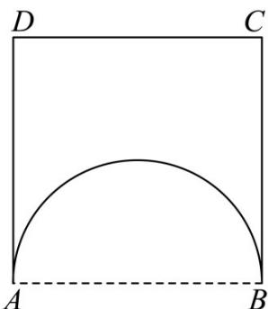

> [!faq]- 《专题14 简单几何体的表面积和体积（高效培优期中专项训练）数学人教A版高一必修第二册》官方解析
>
> > [!success]- **【答案】** 
>
> > [!note]- **【解析】**
> > 由题意可知以线段 CD 的垂直平分线为旋转轴旋转一周得到的几何体是：
> >
> > 底面半径为 $^{1}$ ，高为 $^{2}$ 的圆柱挖去一个半径为 $^{1}$ 的半球，
> >
> > 所以体积为： $\pi \times 1^{2}\times 2 - \frac{1}{2}\times \frac{4}{3}\pi \times 1^{3} = \frac{4}{3}\pi$
> >
> > 故答案为： $\frac{4\pi}{3}$
