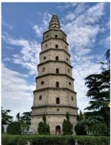
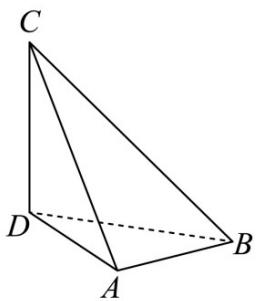

> [!faq]- 《专题14 简单几何体的表面积和体积（高效培优期中专项训练）数学人教A版高一必修第二册》官方解析
>
> > [!success]- **【答案】** $^{(1)}$ 该几何体为上半部分为圆锥，下半部分为圆柱体挖去一个半球体的组合体 (2)表面积 $24\pi$ ；体积为 $\frac{8\sqrt{3}\pi+8\pi}{3}$
>
> > [!note]- **【解析】**
> > （1）该几何体为上半部分为圆锥，下半部分为圆柱体挖去一个半球体的组合体。
> >
> > (2) 由图中的数据可知圆锥的底面半径为 $^{2}$ ，母线长为 $^{4}$ ，高为 $2\sqrt{3}$ ，圆柱的底面半径为 $^{2}$ ，高为 $^{2}$ ，球的半径为 $^{2}$ ，
> >
> > 所以 $S_{组合体} = S_{圆锥侧} + S_{圆柱侧} + S_{半球}$
> >
> > $$
> > = \pi \times 2 \times 4 + 2 \pi \times 2 \times 2 + 2 \pi \times 2 ^ {2} = 8 \pi + 8 \pi + 8 \pi = 2 4 \pi
> > $$
> >
> > 该几何体的体积为：
> >
> > $$
> > V _ {\text {组合体}} = V _ {\text {圆锥}} + V _ {\text {圆柱}} - V _ {\text {半球}} = \frac {1}{3} \times \pi \times 2 ^ {2} \times 2 \sqrt {3} + \pi \times 2 ^ {2} \times 2 - \frac {2}{3} \pi \times 2 ^ {3} = \frac {8 \sqrt {3} \pi + 8 \pi}{3}
> > $$
> >
> > 42. 兴隆塔，建于隋朝，位于区博物馆内·某校开展数学建模活动，有建模课题组的学生选择测量兴隆塔的高度，为此，他们设计了测量方案．如图，兴隆塔垂直于水平面，他们选择了与兴隆塔底部D在同一水平面上的A,B两点，测得AB=54米，在A,B两点观察塔顶C点，仰角分别为 $45^{\circ}$ 和 $\alpha$ ，其中 $\cos\alpha=\frac{\sqrt{6}}{3}$ ， $\angle ADB=45^{\circ}$ ，
> >
> > 
> >
> > 
> >
> > (1)求兴隆塔的高 $CD$ 的长；
> >
> > (2)在（1）的条件下求多面体 $A - BCD$ 的表面积；
> >
> > (3)在（1）的条件下求多面体 $A - BCD$ 的内切球的半径；
> >
> > 【答案】(1)54 米
> >
> > (2) $2916(1+\sqrt{2})$ 平方米；
> >
> > (3) $27(\sqrt{2}-1)$ 米
> >
> > 【详解】（1）设 $CD = x$ 米，在 $\triangle ACD$ 中， $\angle CDA = 90^{\circ}, \angle CAD = 45^{\circ}$ ，则 $AD = x$
> >
> > 在 $\triangle BCD$ 中， $\angle CDB = 90^{\circ}, \angle CBD = \alpha$ ，且 $\cos \alpha = \frac{\sqrt{6}}{3}$ ，
> >
> > 则 $\tan\alpha=\frac{\sqrt{2}}{2}$ ，所以 $BD=\sqrt{2}x$ ，
> >
> > 因为 $\angle ADB = 45^{\circ}$ ，所以由余弦定理得： $x^{2} + 2x^{2} - 2x\cdot \sqrt{2} x\cos 45^{\circ} = 54^{2}$
> >
> > 整理得： $x^{2}=54^{2}$ ，解得x=54（米）.
> >
> > (2) 由 (1) 知 $\triangle ABD, \triangle ACD, \triangle BCD$ 均为直角三角形，
> >
> > $CD = DA = AB = 54$ ， $BD = 54\sqrt{2}$ ，所以 $AC = 54\sqrt{2},BC = 54\sqrt{3}$
> >
> > 所以在 $\triangle ABC$ 中，满足 $AB^{2} + AC^{2} = BC^{2}$ ，所以 $\triangle ABC$ 为直角三角形；
> >
> > 所以 $S_{\triangle ABD} = S_{\triangle ACD} = 1458, S_{\triangle ABC} = S_{\triangle BCD} = 1458\sqrt{2}$
> >
> > 所以 $S_{A-BCD全}=2916(1+\sqrt{2})$ 平方米；
> >
> > (3) 设多面体 A-BCD 的内切球的半径为 r，根据等体积转换：
> >
> > $$
> > V _ {A - B C D} = \frac {1}{3} S _ {\triangle A B D} \cdot C D = \frac {1}{3} S _ {A - B C D \text {全}} \cdot r
> > $$
> >
> > 所以 $r = 27(\sqrt{2} - 1)$ 米；
> >
> > 考点08求组合旋转体的表面积
