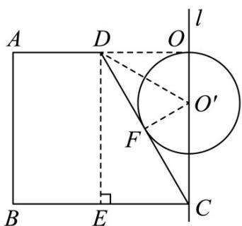

> [!faq]- 《专题14 简单几何体的表面积和体积（高效培优期中专项训练）数学人教A版高一必修第二册》官方解析
>
> > [!success]- **【答案】** (1) $(9 + 4\sqrt{3})\pi a^2$ (2) $\frac{11\sqrt{3}}{3}\pi a^{3}$ (3) $\frac{4\sqrt{3}}{27}\pi a^{3}$
>
> > [!note]- **【解析】**
> > （1）由图可知，该几何体是由一个圆柱挖去一个圆锥构成的，
> >
> > 在直角梯形ABCD中， $|AD| = a$ ， $|BC| = 2a$ ，过点 $D$ 作 $DE\bot BC$ 于点 $E$
> >
> > 则四边形ABED和四边形DECO为矩形， $\left|AD\right| = \left|BE\right| = a,\left|AB\right| = \left|DE\right| = \left|OC\right|$ ，如图所示，
> >
> > 在 $\mathrm{Rt}^{\triangle}$ DEC中，由 $\angle DCB = 60^{\circ}$ 得， $\left|DE\right| = \left|CE\right|\cdot \tan \angle DCE = (2a - a)\cdot \tan 60^{\circ} = \sqrt{3} a$
> >
> > $\left|DC\right| = \frac{\left|CE\right|}{\cos\angle DCE} = \frac{2a - a}{\cos60^{\circ}} = 2a$
> >
> > 所以 $|AB| = |OC| = \sqrt{3}a$ ， $|OD| = a$
> >
> > 因为旋转体的表面积 $S = S_{圆柱} + S_{圆锥侧} - S_{圆锥底}$
> >
> > 所以 $S = 2\pi \cdot 2a \cdot \sqrt{3}a + 2\pi(2a)^{2} + \pi \cdot a \cdot 2a - \pi a^{2} = (9 + 4\sqrt{3})\pi a^{2}$
> >
> > (2) 因为旋转体的体积 $V = V_{圆柱} - V_{圆锥}$
> >
> > 所以旋转体的体积 $V = \pi \cdot (2a)^{2} \times \sqrt{3} a - \frac{1}{3}\pi \cdot a^{2} \cdot \sqrt{3} a = \frac{11\sqrt{3}}{3}\pi a^{3}$
> >
> > (3) 设圆锥 CO 的内切球球心为 $O'$ ，半径为 R，则点 $O'$ 在直线 l 上，
> >
> > 设球 $O'$ 切 $CD$ 于点 $F$ ，连接 $DO', O'F$
> >
> > 则 $\angle DFO' = 90^{\circ},\left|OO'\right| = \left|O'F\right| = R$ ， $\left|O'C\right| = \sqrt{3} a - R$
> >
> > 因为 $\angle DCB = 60^{\circ}$ ，所以 $\angle O'CF = 30^{\circ}$
> >
> > 在 $\mathrm{Rt}\triangle O^{\prime}CF$ 中， $\sin \angle O^{\prime}CF = \frac{|O^{\prime}F|}{|O^{\prime}C|} = \frac{R}{\sqrt{3}a - R} = \frac{1}{2}$ ，解得 $R = \frac{\sqrt{3}}{3} a$
> >
> > 所以圆锥 $\mathrm{CO}$ 的内切球体积 $V = \frac{4}{3}\pi R^3 = \frac{4}{3}\pi \cdot (\frac{\sqrt{3}}{3} a)^3 = \frac{4\sqrt{3}}{27}\pi a^3$
> >
> > 
