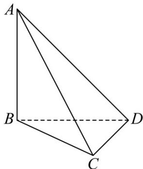
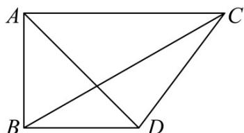
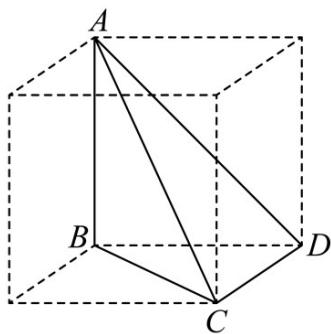

> [!faq]- 《专题14 简单几何体的表面积和体积（高效培优期中专项训练）数学人教A版高一必修第二册》官方解析
>
> > [!success]- **【答案】** 
>
> > [!note]- **【解析】**
> > 三棱锥 A-BCD 的部分平面展开图如图所示：
> >
> > 
> >
> > 设 $CD = x$ ，由题意得： $C^{\prime}D = CD = x$ ， $C'B = \sqrt{17}$
> >
> > 在 $\triangle C^{\prime}BD$ 中，由余弦定理得： $C^{\prime}B^{2} = C^{\prime}D^{2} + BD^{2} - 2C^{\prime}D\cdot BD\cdot \cos 135^{\circ}$
> >
> > 即 $\left(\sqrt{17}\right)^2 = x^2 +\left(\sqrt{2}\right)^2 - 2x\cdot \sqrt{2}\cdot \left(-\frac{\sqrt{2}}{2}\right)$ ，即 $x^{2} + 2x - 15 = 0$
> >
> > 解得 $x = 3$ 或 $x = -5$ （舍去），如图所示：
> >
> > 
> >
> > 该棱锥的外接球即为长方体的外接球，
> >
> > 则外接球的半径为： $R = \frac{1}{2}\sqrt{\left(\sqrt{2}\right)^2 + \left(\sqrt{2}\right)^2 + 3^2} = \frac{\sqrt{13}}{2}$
> >
> > 所以该棱锥的外接球的表面积为 $4\pi R^{2} = 13\pi$
> >
> > 故答案为： $13\pi$
