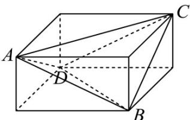

> [!faq]- 《专题14 简单几何体的表面积和体积（高效培优期中专项训练）数学人教A版高一必修第二册》官方解析
>
> > [!success]- **【答案】** $\frac{7\sqrt{14}}{3}\pi/\frac{7\sqrt{14}\pi}{3}$
>
> > [!note]- **【解析】**
> > 将四面体 ABCD 放入长方体中，如图所示：
> >
> > 
> >
> > 设长方体的长，宽，高分别为 $a, b, c$ ，则 $\left\{ \begin{array}{l} a^2 + b^2 = 13 \\ a^2 + c^2 = 10 \\ b^2 + c^2 = 5 \end{array} \right.$ ，所以 $a^2 + b^2 + c^2 = 14$
> >
> > 设长方体的外接球半径为 $r$ ，则 $\left(2r\right)^2 = a^2 + b^2 + c^2 = 14$ ，解得 $r = \frac{\sqrt{14}}{2}$ ，
> >
> > 又长方体的处接球即为四面体 ABCD 的外接球，
> >
> > 所以四面体 ABCD 的外接球的体积为 $V = \frac{4}{3} \pi r^{3} = \frac{7\sqrt{14}}{3} \pi$ .
> >
> > 故答案为： $\frac{7\sqrt{14}\pi}{3}$
