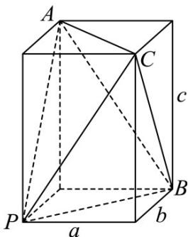
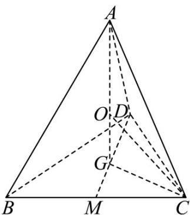

> [!faq]- 《专题14 简单几何体的表面积和体积（高效培优期中专项训练）数学人教A版高一必修第二册》官方解析
>
> > [!success]- **【答案】** D
>
> > [!note]- **【解析】**
> > 将三棱锥补成长方体，则三棱锥 P-ABC 的外接球等价于长方体的外接球，设长方体的长宽高分别为 a, b, c，
> >
> > 则 $\left\{ \begin{array}{l}a^{2} + b^{2} = 5\\ b^{2} + c^{2} = 10\\ a^{2} + c^{2} = 13 \end{array} \right.$ ，可得 $a^2 +b^2 +c^2 = 14$
> >
> > 所以长方体的外接球半径 $R=\frac{\sqrt{a^{2}+b^{2}+c^{2}}}{2}=\frac{\sqrt{14}}{2}$
> >
> > 所以三棱锥的外接球的表面积为 $S = 4\pi R^{2} = 14\pi$ .
> >
> > 
> >
> > 故选：D·
> >
> > 53．盲盒是一种深受大众喜爱的玩具，某盲盒生产厂商要为棱长为 $8cm$ 的正四面体魔方设计一款正方体的包装盒，需要保证该魔方可以在包装盒内任意转动，则包装盒的棱长最小值为 \_\_\_\_ cm.
> >
> > 【答案】 $4 \sqrt{6}$
> >
> > 【详解】如图，A-BCD 是棱长为 $8 \, cm$ 的正四面体，
> >
> > 
> >
> > 由题意， $AD = BD = DC = 8\mathrm{cm}$ ，设 $BC$ 的中点为 $M$ ，底面 $\triangle BCD$ 的重心为 $G$
> >
> > O 为外接球的球心，则有 $AG \perp$ 底面 BCD，
> >
> > $MD=\frac{\sqrt{3}}{2}DC=4\sqrt{3},CG=DG=\frac{2}{3}MD=\frac{8\sqrt{3}}{3},OA=OC=R,R$ 是外接球半径，
> >
> > 在 Rt△AGD 中， $GA=\sqrt{AD^{2}-DG^{2}}=\frac{8\sqrt{6}}{3}$ ，
> >
> > 在 $\mathrm{Rt}\triangle OGC$ 中， $OG = \sqrt{OC^2 - GC^2} = \sqrt{R^2 - \frac{64}{3}}$ ， $OG + OA = GA$ ，所以 $\sqrt{R^2 - \frac{64}{3}} + R = \frac{8\sqrt{6}}{3}$
> >
> > 解得 $R = 2\sqrt{6} \, (\text{cm})$ ，即正方体的最短棱长为 $2R = 4\sqrt{6} \, (\text{cm})$ .
> >
> > 故答案为： $4\sqrt{6}$
