> [!faq]- 《专题14 简单几何体的表面积和体积（高效培优期中专项训练）数学人教A版高一必修第二册》官方解析
>
> > [!success]- **【答案】** 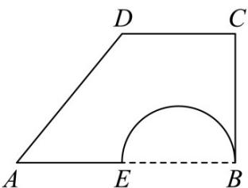 A. $\frac{28\pi}{3}$ B. $\frac{22\pi}{3}$ C. $7\pi$ D. $6\pi$
>
> > [!note]- **【解析】**
> > 旋转后得到的几何体为两个同底面的圆柱，圆锥，再去掉一个球体得到
> >
> > 由题可得圆柱，圆锥的底面半径为 $CB$ ，
> >
> > 又 $AB \parallel DC, BC \perp AB, \angle A = \frac{\pi}{4}, AB = 2CD = 4$ ，则 $DE \perp AB, DE = CB$ ，
> >
> > 三角形 $ADE$ 为等腰直角三角形，则 $DE = CB = \frac{1}{2} AB = 2$
> >
> > 又由题可得圆柱，圆锥的高均为 $^{2}$ ，
> >
> > 则圆柱，圆锥体积之和为： $\frac{1}{3}\pi \times 2^2\times 2 + \pi \times 2^2\times 2 = \frac{32}{3}\pi$
> >
> > 又注意到球体半径为 $\frac{1}{2} EB = \frac{1}{4} AB = 1$ ，则球体体积为： $\frac{4}{3}\pi \times 1^3 = \frac{4}{3}\pi$
> >
> > 则几何体体积为 $\frac{32 - 4}{3}\pi = \frac{28}{3}\pi$
> >
> > 故选：A
> >
> > 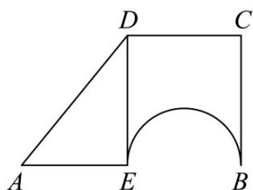
> >
> > 56. 多面体也称柏拉图立体，被誉为最有规律的立体结构，其所有面都只由一种正多边形构成的多面体（各面都是全等的正多边形，且每一个顶点所接的面数都一样，各相邻面所成二面角都相等）。数学家已经证明世界上只存在五种柏拉图立体，即正四面体、正六面体，正八面体、正十二面体、正二十面体，如图所示为正八面体，则该正八面体的外接球与内切球的表面积的比为\_\_\_\_。
> >
> > 【答案】
> >
> > 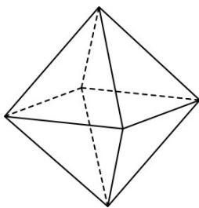
> >
> > 【答案】3:1
> >
> > 【详解】由正八面体的结构特征易知，其外接球和内切球的球心重合，且为体对角线的交点，令正八面体的棱长为 $^{2}$ ，外接球和内切球的半径分别为R,r，则外接球半径 $R=\sqrt{2}$ ，
> >
> > 各侧面积 $S = \frac{1}{2} \times 2 \times 2 \times \sin 60^{\circ} = \sqrt{3}$ ，构成正八面体的两个正四棱锥的高为 $\sqrt{2}$ ，
> >
> > 所以正八面体的体积 $V = 8 \times \frac{1}{3} \cdot rS = 2 \times \frac{1}{3} \times \sqrt{2} \times 2 \times 2$ ，可得 $r = \frac{\sqrt{6}}{3}$
> >
> > 所以外接球和内切球的表面积比为 $R^{2}:r^{2}=2:\frac{2}{3}=3:1$ .
> >
> > 故答案为：3:1
> >
> > 57．石墩是常见的维护交通秩序的道路设施．某路口放置的石墩（如图），其上部是原球半径为 $15 \, cm$ 的球缺，下部可看作是上、下底面半径分别为 $9 \, cm$ 、 $16 \, cm$ 的圆台，球缺的截面圆与圆台的上底面完全吻合，整个石墩的高为 $33 \, cm$ ，则石墩的体积为（）
> >
> > 【答案】
> >
> > （注：球体被平面所截，截得的部分叫球缺，球缺表面上的点到截面的最大距离为球缺的高，球缺的体积 $V=\frac{1}{3}\pi(3R-h)\cdot h^{2}$ ，其中 $_{R}$ 为原球半径， $_{h}$ 为球缺的高。）
> >
> > 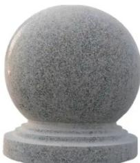
> >
> > A $4374\pi \mathrm{cm}^3$ B $5048\pi \mathrm{cm}^3$ C $5336\pi \mathrm{cm}^3$ D $7260\pi \mathrm{cm}^3$
> >
> > 【答案】C
> >
> > 【详解】如图，FC为整个几何体的高度，设A为球心，B,C分别为圆台上下底面圆心，则 $FC = 33\mathrm{cm}$ ， $r_1 = BD = 9\mathrm{cm}, r_2 = EC = 16\mathrm{cm}$ ， $R = AD = 15\mathrm{cm}$ 所以 $AB = \sqrt{AD^2 - DB^2} = 12\mathrm{cm}$ ，则球缺的高 $h = FB = R + AB = 27\mathrm{cm}$ 则圆台的高 $h' = BC = FC - FB = 6\mathrm{cm}$ 故石墩的体积为 $V = V_{\text{球缺}} + V_{\text{圆台}} = \frac{1}{3}\pi(3R - h)\cdot h^2 +\frac{1}{3} h'\pi(r_1^2 +r_2^2 +r_1r_2)$ $= \left[\frac{1}{3}\pi(3\times 15 - 27)\times 27^2 +\frac{1}{3}\times 6\pi (9^2 +16^2 +9\times 16)\right]\mathrm{cm}^2 = 5336\pi \mathrm{cm}^2.$
> >
> > 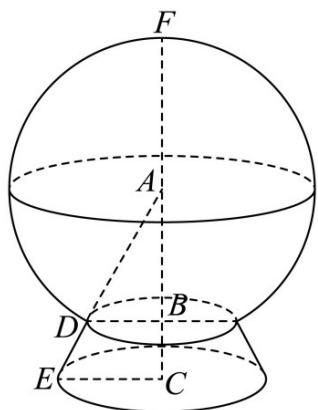
> >
> > 故选：C.
> >
> > 58. 灯笼起源于中国的西汉时期，两千多年来，每逢春节人们便会挂起象征美好团圆意义的红灯笼，营造一种喜庆的氛围·如图 $^{1}$ ，某球形灯笼的轮廓由三部分组成，上下两部分是两个相同的圆柱的侧面，中间是球面的一部分（除去两个球缺）·如图 $^{2}$ ，“球缺”是指一个球被平面所截后剩下的部分，截得的圆面叫做球缺的底，垂直于截面的直径被截得的一段叫做球缺的高·已知球缺的体积公式为 $V=\frac{\pi}{3}(3R-h)h^{2}$ ，其中 R 是球的半径，h 是球缺的高·已知该灯笼的高为 40cm，圆柱的高为 4 cm，圆柱的底面圆直径为 24 cm，则该灯笼的体积为（取 $\pi=3$ ）（）
> >
> > 【答案】
> >
> > 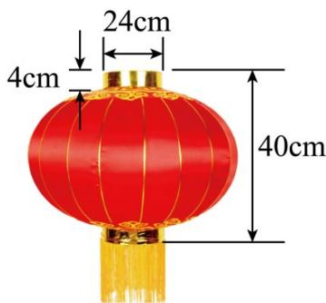
> > 图1
> >
> > 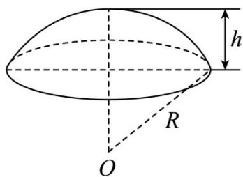
> > 图2
> >
> > A $32000\mathrm{cm}^3$ B $33664\mathrm{cm}^3$ C $33792\mathrm{cm}^3$ D $35456\mathrm{cm}^3$
> >
> > <!-- source-part:2 pages:51-57 -->
> >
> > 【答案】B
> >
> > 【详解】该灯笼去掉圆柱部分的高为 $40 - 8 = 32 \, cm$ ，则 $R - h = \frac{32}{2} = 16 \, cm$ ，
> >
> > 由圆柱的底面圆直径为 $24\mathrm{cm}$ ，则有 $\left(R - h\right)^2 + 12^2 = R^2$
> >
> > 即 $16^{2} + 12^{2} = R^{2}$ ，可得 $R = 20$ ，则 $h = 4$
> >
> > $$
> > V = 2 V _ {\text {圆柱}} + V _ {\text {球}} - 2 V _ {\text {球缺}} = 2 \times 4 \times 1 2 ^ {2} \times \pi + \frac {4}{3} \times \pi \times 2 0 ^ {3} - 2 \times \frac {\pi}{3} (6 0 - 4) \times 4 ^ {2}
> > $$
> >
> > $$
> > = 3 4 5 6 + 3 2 0 0 0 - 1 7 9 2 = 3 3 6 6 4.
> > $$
> >
> > 故选：B.
> >
> > 59. 球面被平面所截得的一部分叫做球冠，截得的圆叫做球冠的底，垂直于截面的直径被截得的一段叫做球冠的高·球被平面截下的一部分叫做球缺，截面叫做球缺的底面，垂直于截面的直径被截下的线段长叫做球缺的高，球缺是旋转体，可以看做是球冠和其底所在的圆面所围成的几何体·如图1，一个球面的半径为R，球冠的高是h，球冠的表面积公式是 $S=2\pi Rh$ ，与之对应的球缺的体积公式是 $V=\frac{1}{3}\pi h^{2}(3R-h)$ ·如图2，已知C，D是以AB为直径的圆上的两点， $\angle AOC=\angle BOD=\frac{\pi}{3}$ ， $S_{扇形COD}=2\pi$ ，则扇形COD绕直线AB旋转一周形成的几何体的体积为\_\_\_\_。
> >
> > 【答案】
> >
> > 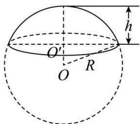
> > 图1
> >
> > 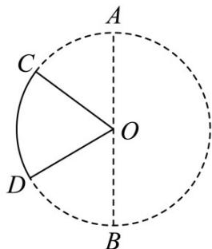
> > 图2
> >
> > 【答案】 $16\sqrt{3}\pi$
> >
> > 【详解】因为 $\angle AOC = \angle BOD = \frac{\pi}{3}$ ，所以 $\angle DOC = \pi - 2 \times \frac{\pi}{3} = \frac{\pi}{3}$
> >
> > 设圆的半径为 $R$ ，又 $S_{\text{扇形} COD} = \frac{1}{2} \times \frac{\pi}{3} R^2 = 2\pi$ ，解得 $R = 2\sqrt{3}$ （负值舍去），
> >
> > 过点 C 作 $CE \perp AB$ 交 AB 于点 E ，过点 D 作 $DF \perp AB$ 交 AB 于点 F
> >
> > 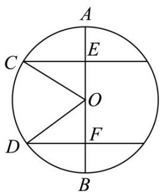
> >
> > 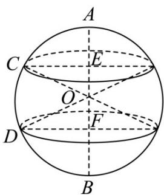
> >
> > 则 $CE = OC\sin \frac{\pi}{3} = 3$ ， $OE = OC\cos \frac{\pi}{3} = \sqrt{3}$
> >
> > 所以 $AE = R - OE = \sqrt{3}$ ，同理可得 $DF = 3$ ， $OF = BF = \sqrt{3}$
> >
> > 将扇形 $COD$ 绕直线 $AB$ 旋转一周形成的几何体为一个半径 $R = 2\sqrt{3}$ 的球中上下截去两个球缺所剩余部分再挖去两个圆锥，
> >
> > 其中球缺的高 $h = \sqrt{3}$ ，圆锥的高 $h_1 = \sqrt{3}$ ，底面半径 $r = 3$ ，
> >
> > 则其中一个球缺的体积 $V_{1} = \frac{1}{3}\pi h^{2}(3R - h) = \frac{1}{3}\pi \times (\sqrt{3})^{2}(3\times 2\sqrt{3} -\sqrt{3}) = 5\sqrt{3}\pi$
> >
> > 圆锥的体积 $V_{2}=\frac{1}{3}\pi\times3^{2}\times\sqrt{3}=3\sqrt{3}\pi$ ，球的体积 $V_{3}=\frac{4}{3}\pi R^{3}=\frac{4}{3}\pi\times\left(2\sqrt{3}\right)^{3}=32\sqrt{3}\pi$ ，所以几何体的体积 $V=V_{3}-2V_{1}-2V_{2}=16\sqrt{3}\pi$ .
> >
> > 故答案为： $16\sqrt{3}\pi$
> >
> > 60. 红薯于 $1593$ 年被商人陈振龙引入中国，也叫甘薯、番薯等，因其生食多汁、熟食如蜜，成为人们喜爱的美食甜点·敦敦和融融在步行街买了一根香气扑鼻的烤红薯，准备分着吃·如图，该红薯可近似看作三个部分：左边部分是半径为 $R$ 的半球；中间部分是底面半径是为 $R$ 、高为 $2R$ 的圆柱；右边部分是底面半径为 $R$ 、高为 $R$ 的圆锥，若敦敦准备从中间部分的 $A$ 处将红薯切成两块，则两块红薯体积差的绝对值为（）
> >
> > 【答案】
> >
> > 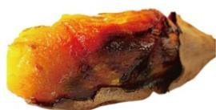
> >
> > 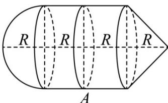
> >
> > A. $\frac{1}{3}\pi R^3$ B. $\frac{2}{3}\pi R^3$ C. $\frac{5}{6}\pi R^3$ D. $\pi R^3$
> >
> > 【答案】A
> >
> > 【详解】由题意可知，两块红薯体积差的绝对值为 $\left|\frac{1}{2}\times\frac{4\pi}{3}R^{3}+\pi R^{2}\cdot R-(\pi R^{2}\cdot R+\frac{\pi}{3}R^{2}\cdot R)\right|$ $=\left|\frac{2\pi}{3}R^{3}-\frac{\pi}{3}R^{3}\right|=\frac{\pi}{3}R^{3}$ .
> >
> > 故选：A.
> >
> > ## 考点11求旋转体的体积
