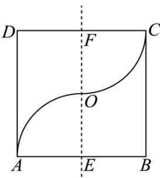
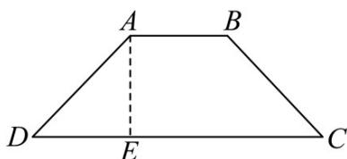

> [!faq]- 《专题14 简单几何体的表面积和体积（高效培优期中专项训练）数学人教A版高一必修第二册》官方解析
>
> > [!success]- **【答案】** 
>
> > [!note]- **【解析】**
> > 易知旋转所形成的几何体是以底面半径为 $^{1}$ ，高为 $^{2}$ 的圆柱被挖去了上下两个半球，且半球的半径为 $^{1}$ ，
> > 因此围成的几何体的体积是 $\pi \times 1^{2} \times 2 - \frac{4\pi}{3} \times 1^{3} = \frac{2\pi}{3}$ .
> > 故答案为： $\frac{2\pi}{3}$
> >
> > 62．《数学汇编》第3卷中记载着一个确定重心的定理：“如果同一平面内的一个闭合图形的内部与一条直线不相交，那么该闭合图形围绕这条直线旋转一周所得到的旋转体的体积等于闭合图形面积乘以该闭合图形的重心旋转所得周长的积”，即 $V = sl$ （ $V$ 表示平面图形绕旋转轴旋转的体积， $s$ 表示平面图形的面积， $l$ 表示重心绕旋转轴旋转一周的周长）．如图，等腰梯形ABCD，已知 $AB \parallel DC, AE \perp CD, CD = 3AB, AE = 6$ 则其重心G到CD的距离为（）
> >
> > 【答案】
> >
> > 
> >
> > A. $\frac{5}{4}$ B. $\frac{3}{2}$ C. 2 D. $\frac{5}{2}$
> >
> > 【答案】D
> >
> > 【详解】设 AB = x, CD = 3x ，重心 G 到 CD 的距离为 $h'$
> >
> > 易知等腰梯形绕 $CD$ 旋转一周所得的几何体的体积 $V = \frac{1}{3}\pi \cdot 6^{2}\cdot x\cdot 2 + \pi \cdot 6^{2}\cdot x = 60\pi x$
> >
> > 梯形 ABCD 的面积 $S=\frac{1}{2}\cdot(x+3x)\cdot6=12x$ ，重心绕旋转轴旋转一周的周长 $l=2\pi h'$ ，
> >
> > 则 $60\pi x = 12x \cdot (2\pi h')$ ，解得 $h' = \frac{5}{2}$ .
> >
> > 故选 **D**.
