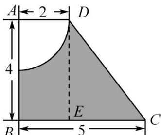

> [!faq]- 《专题14 简单几何体的表面积和体积（高效培优期中专项训练）数学人教A版高一必修第二册》官方解析
>
> > [!success]- **【答案】** $S_{表}=68\pi,\frac{140}{3}\pi.$
>
> > [!note]- **【解析】**
> > 由题意知，所求旋转体的表面积由圆台下底面、侧面和一半球面组成。在直角梯形ABCD中，过D点作 $DE^{\perp}BC$ ，垂足为E，
> >
> > 
> >
> > 在 Rt△DEC 中， $CD=\sqrt{CE^{2}+DE^{2}}=5$
> >
> > 所以 $S_{半球}=\frac{1}{2}\times4\pi\times2^{2}=8\pi$ ， $S_{圆台侧}=\frac{1}{2}\times5\times(2\pi\times2+2\pi\times5)=35\pi$ ， $S_{圆台下底}=25\pi$ ，
> > ∴ $S_{表} = 8\pi + 35\pi + 25\pi = 68\pi$ .
> >
> > 因为圆台的体积 $V=\frac{1}{3}\left(\pi\times2^{2}+\sqrt{\left(\pi\times2^{2}\right)\left(\pi\times5^{2}\right)}+\pi\times5^{2}\right)\times4=52\pi$
> >
> > 半球的体积 $V_{1}=\frac{1}{2}\times\frac{4}{3}\times\pi\times2^{3}=\frac{16}{3}\pi$ ，所以所求几何体的体积为 $V-V_{1}=\frac{140}{3}\pi$ .
