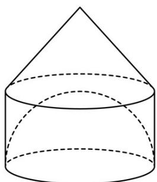

> [!faq]- 《专题14 简单几何体的表面积和体积（高效培优期中专项训练）数学人教A版高一必修第二册》官方解析
>
> > [!success]- **【答案】** (1)答案见解析 (2) $S_{\text{组合体}} = (4\sqrt{2} + 16)\pi$ , $V_{\text{组合体}} = \frac{16}{3}\pi$
>
> > [!note]- **【解析】**
> > （1）根据题意知，将所得平面图形绕直线 DE 旋转一圈后所得几何体是上部是圆锥，下部是圆柱挖去一个半径等于圆柱体高的半球的组合体；
> >
> > 
> >
> > (2) 该组合体的表面积为
> >
> > $$
> > S _ {\text {几何体}} = S _ {\text {圆锥侧}} + S _ {\text {圆柱侧}} + S _ {\text {半球}} = \frac {1}{2} \times 2 \pi \times 2 \times 2 \sqrt {2} + 2 \pi \times 2 \times 2 + \frac {1}{2} \times 4 \pi \times 2 ^ {2} = (4 \sqrt {2} + 1 6) \pi
> > $$
> >
> > 组合的体积为
> >
> > $$
> > V _ {\text {几何体}} = V _ {\text {圆锥}} + V _ {\text {圆柱}} - V _ {\text {半球}} = \frac {1}{3} \times \pi \times 2 ^ {2} \times 2 + \pi \times 2 ^ {2} \times 2 - \frac {1}{2} \times \frac {4}{3} \times \pi \times 2 ^ {3} = \frac {1 6}{3} \pi .
> > $$
