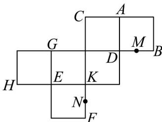

<!-- question-source:start -->
10．如图是一个棱长为 $^{2}$ 的正方体的展开图，其中M,N分别是棱DB,KF的中点．请以G,E,K三点所在面为底面将展开图还原为正方体．

(1)求证：点 $M$ 在平面 $AEN$ 内；

(2)用平面 $AEN$ 截正方体，将正方体分成两个几何体，两个几何体的体积分别为 $V_{1}, V_{2} \left( V_{1} < V_{2} \right)$ ，试判断体积较小的几何体的形状（不需要证明），并求 $V_{1}: V_{2}$ 的值。
<!-- question-source:end -->

![[高中/课堂同步/题库/人教A版高中数学同步讲义(2026)/02_必修第二册/期中专项训练+期中模拟卷/专题15 空间点、直线、平面之间的位置关系（高效培优期中专项训练）数学人教A版高一必修第二册/专题15_空间点_直线_平面之间的位置关系/questions/answers/Q00077277A1.md]]
