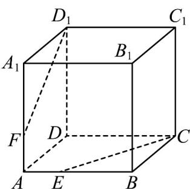

<!-- question-source:start -->
15. 如图，在正方体 $ABCD - A_{1}B_{1}C_{1}D_{1}$ 中， $E, F$ 分别是 $AB, AA_{1}$ 上的点，且 $A_{1}F = 2FA, BE = 2AE$ .

(1)证明： $E,C,D_{1},F$ 四点共面；

(2)设 $D_{1}F\cap CE = O$ ，证明： $A$ ， $O$ ， $D$ 三点共线·
<!-- question-source:end -->

![[高中/课堂同步/题库/人教A版高中数学同步讲义(2026)/02_必修第二册/期中专项训练+期中模拟卷/专题15 空间点、直线、平面之间的位置关系（高效培优期中专项训练）数学人教A版高一必修第二册/专题15_空间点_直线_平面之间的位置关系/questions/answers/Q00077281A1.md]]
