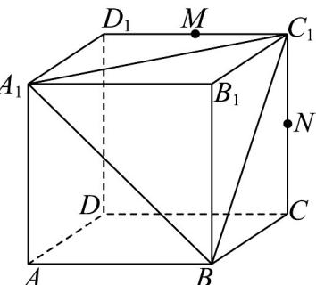

<!-- question-source:start -->
19. 已知正方体 $ABCD - A_{1}B_{1}C_{1}D_{1}$ 中， $AB = 2$ ，点 $M, N$ 分别是线段 $C_{1}D_{1}, CC_{1}$ 的中点。

(1)求三棱锥 $M - A_{1}C_{1}B$ 的体积；

(2)求证：直线 $A_{1}M$ 、 $BN$ 、 $B_{1}C_{1}$ 三线共点.
<!-- question-source:end -->

![[高中/课堂同步/题库/人教A版高中数学同步讲义(2026)/02_必修第二册/期中专项训练+期中模拟卷/专题15 空间点、直线、平面之间的位置关系（高效培优期中专项训练）数学人教A版高一必修第二册/专题15_空间点_直线_平面之间的位置关系/questions/answers/Q00077284A1.md]]
