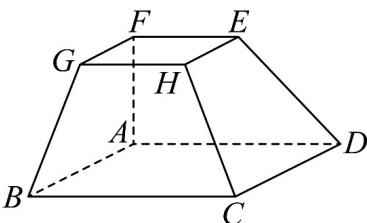

<!-- question-source:start -->
20. 如图，在多面体 $ABCDEFGH$ 中，四边形 $ABCD$ 和四边形 $EFGH$ 均为正方形，四边形 $ABGF$ 和四边形 $ADEF$ 均为梯形，其中 $AB//FG$ ， $AD//EF$ ，且 $AB = 2FG$ .

(1)证明：B，D，E，G四点共面·

(2)证明： $AF,BG,DE$ 三条直线交于一点·
<!-- question-source:end -->

![[高中/课堂同步/题库/人教A版高中数学同步讲义(2026)/02_必修第二册/期中专项训练+期中模拟卷/专题15 空间点、直线、平面之间的位置关系（高效培优期中专项训练）数学人教A版高一必修第二册/专题15_空间点_直线_平面之间的位置关系/questions/answers/Q00077285A1.md]]
