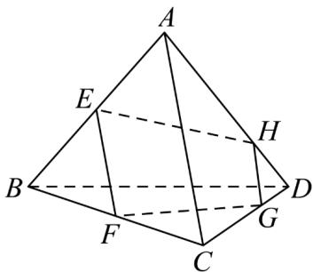

<!-- question-source:start -->
24．如图，已知空间四边形ABCD，E，F分别是AB，BC的中点，G，H分别在CD和AD上，且满足 $\frac{CG}{GD} = \frac{AH}{HD} = 2$ ．求证：

(1) $E, F, G, H$ 四点共面；

(2) $EH$ ，FG，BD三线共点.
<!-- question-source:end -->

![[高中/课堂同步/题库/人教A版高中数学同步讲义(2026)/02_必修第二册/期中专项训练+期中模拟卷/专题15 空间点、直线、平面之间的位置关系（高效培优期中专项训练）数学人教A版高一必修第二册/专题15_空间点_直线_平面之间的位置关系/questions/answers/Q00077289A1.md]]
