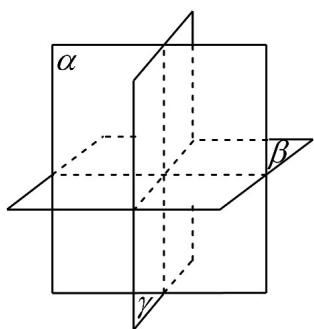

> [!faq]- 《专题15 空间点、直线、平面之间的位置关系（高效培优期中专项训练）数学人教A版高一必修第二册》官方解析
>
> > [!success]- **【答案】** B
>
> > [!note]- **【解析】**
> > A. 如果两个平面有三个公共点，那么这两个平面可能相交或重合，所以该选项错误；
> >
> > B. 若四点不共面，则其中任意三点不共线，所以该选项正确；
> >
> > C. 空间中，相交于同一点的三条直线不一定在同一平面内，如三棱锥 P-ABC，相交于同一点 P 的三条直线 PA, PB, PC 不在同一平面内，所以该选项错误；
> >
> > D. 三个不重合的平面最多可将空间分成八个部分，所以该选项错误
> >
> > 故选：B
> >
> > 
