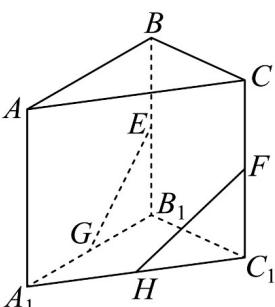
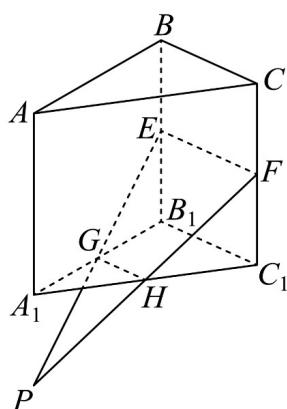

> [!faq]- 《专题15 空间点、直线、平面之间的位置关系（高效培优期中专项训练）数学人教A版高一必修第二册》官方解析
>
> > [!success]- **【答案】**  A. $E,F,G,H$ 四点共面 B. $EF / / GH$ C. $EG, FH, AA_{1}$ 三线共点 D. $\angle EGB_{1} = \angle FHC_{1}$
>
> > [!note]- **【解析】**
> > 对于 AB，如图，连接 EF，GH，
> >
> > 
> >
> > 因为 $GH$ 是 $\triangle A_{1}B_{1}C_{1}$ 的中位线，所以 $GH // B_{1}C_{1}$
> >
> > 因为 $B_{1}E \parallel C_{1}F$ ，且 $B_{1}E = C_{1}F$ ，所以四边形 $B_{1}EFC_{1}$ 是平行四边形，
> >
> > 所以 $EF//B_{1}C_{1}$ ，所以 $EF//GH$ ，所以 E, F, G, H 四点共面，故 AB 正确；
> >
> > 对于 C，如图，延长 EG，FH 相交于点 P，
> >
> > 因为 $P \in EG$ ， $EG \subset$ 平面 $ABB_{1}A_{1}$ ，所以 $P \in$ 平面 $ABB_{1}A_{1}$
> >
> > 因为 $P \in FH$ ， $FH \subset$ 平面 $ACC_{1}A_{1}$ ，所以 $P \in$ 平面 $ACC_{1}A_{1}$ ，
> >
> > 因为平面 $ABB_{1}A_{1} \cap$ 平面 $ACC_{1}A_{1} = AA_{1}$
> >
> > 所以 $P \in AA_{1}$ ，所以 EG, FH, $AA_{1}$ 三线共点，故 C 正确；
> >
> > 对于 $\mathbb{D}$ ，因为 $EB_{1} = FC_{1}$ ，当 $GB_{1}\neq HC_{1}$ 时， $\tan \angle EGB_1\neq \tan \angle FHC_1$
> >
> > 又 $0 < \angle EGB_{1}, \angle FHC_{1} < \frac{\pi}{2}$ ，则 $\angle EGB_{1} \neq \angle FHC_{1}$ ，故D错误·
> >
> > 故选 **D**.
