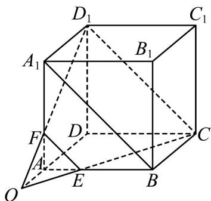

> [!faq]- 《专题15 空间点、直线、平面之间的位置关系（高效培优期中专项训练）数学人教A版高一必修第二册》官方解析
>
> > [!success]- **【答案】** (1)证明见祥解 (2)证明见祥解
>
> > [!note]- **【解析】**
> > （1）证明：如图，连接 $EF, A_{1}B, D_{1}C$ 。
> >
> > 
> >
> > 在正方体 $ABCD - A_1B_1C_1D_1$ 中， $A_1F = 2FA, BE = 2AE$ ，所以 $EF \parallel A_1B$ ，
> > 又 $BC \parallel A_1D_1$ ，且 $BC = A_1D_1$ ，
> > 所以四边形 $BCD_1A_1$ 是平行四边形，所以 $A_1B \parallel D_1C$ ， $\therefore EF \parallel D_1C$ ，所以 $E, C, D_1, F$ 四点共面；
> > （2）证明：由 $D_1F \cap CE = O$ ， $\therefore O \in D_1F$ ，又 $D_1F \subset$ 平面 $ADD_1A_1$ ， $\therefore O \in$ 平面 $ADD_1A_1$ ，
> > 同理 $O \in$ 平面 $ABCD$ ，又平面 $ADD_1A_1 \cap$ 平面 $ABCD = AD$ ， $\therefore O \in AD$ ，即 $A, O, D$ 三点共线·
