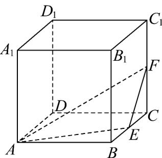
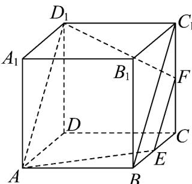

> [!faq]- 《专题15 空间点、直线、平面之间的位置关系（高效培优期中专项训练）数学人教A版高一必修第二册》官方解析
>
> > [!success]- **【答案】**  A. $\frac{3}{2}$ B. $\frac{9}{2}$ C. 9 D. 18
>
> > [!note]- **【解析】**
> > 由题知连接 $BC_{1}$ ， $AD_{1}$ ， $D_{1}F$ ，如图所示
> >
> > 
> >
> > 因为 $E, F$ 分别是 $BC, CC_{1}$ 的中点，所以 $EF \parallel BC_{1}$
> >
> > 在正方体中 $AD_{1} \parallel BC_{1}$ ，所以 $EF \parallel AD_{1}$
> >
> > 所以 $A, D_{1}, E, F$ 在同一平面内，
> >
> > 所以平面 $AEF$ 截该正方体所得的截面为平面 $EFD_{1}A$ ，因为正方体的棱长为2，
> >
> > 所以 $EF = \sqrt{2}$ ， $AD_{1} = 2\sqrt{2}$ ， $D_{1}F = AE = \sqrt{2^{2} + 1^{2}} = \sqrt{5}$
> >
> > 则 $E$ 到 $AD_{1}$ 的距离为等腰梯形 $EFD_{1}A$ 的高为 $\sqrt{\left(\sqrt{5}\right)^2 - \left(\frac{2\sqrt{2} - \sqrt{2}}{2}\right)^2} = \frac{3\sqrt{2}}{2}$
> >
> > 所以截面面积为 $S = \frac{1}{2}\left(2\sqrt{2} +\sqrt{2}\right)\times \frac{3\sqrt{2}}{2} = \frac{9}{2}$ ，故B正确·
> >
> > 故选 **B**.
