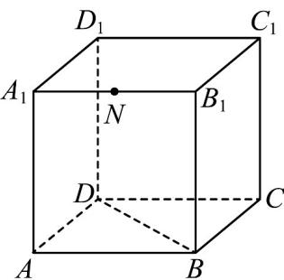
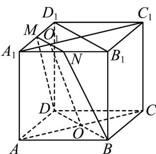

> [!faq]- 《专题15 空间点、直线、平面之间的位置关系（高效培优期中专项训练）数学人教A版高一必修第二册》官方解析
>
> > [!success]- **【答案】**  A. $4\sqrt{2}$ B. $\frac{9}{2}$ C. $4\sqrt{3}$ D. $2\sqrt{6}$
>
> > [!note]- **【解析】**
> > 连接 $B_{1}D_{1}$ ，取 $A_{1}D_{1}$ 的中点M，连接MN,DM,BN，
> > 因为 N 是 $A_{1}B_{1}$ 的中点，所以 $MN\parallel B_{1}D_{1}$ ， $MN=\frac{1}{2}B_{1}D_{1}=\sqrt{2}$ ，
> > 因为 $BD\parallel B_{1}D_{1}$ ， $BD=B_{1}D_{1}$ ，所以 $MN\parallel BD$ ， $MN=\frac{1}{2}BD=\sqrt{2}$ 所以过 B、D、N 的平面 $\alpha$ 截该正方体所得截面为梯形 BDMN
> > 连接 AC 交 BD 于 O，连接 $A_{1}C_{1}$ 交 MN 于 $O_{1}$ ，连接 $OO_{1}$ ，
> > 因为 $B_{1}N = D_{1}M = 1, BB_{1} = DD_{1} = 2, \angle BB_{1}N = \angle DD_{1}M = 90^{\circ}$ ，
> > 所以 $BN = DM = \sqrt{5}$ ，所以梯形 BDMN 为等腰梯形，
> > 所以 $OO_{1}=\sqrt{BN^{2}-(OB-O_{1}N)^{2}}=\sqrt{5-\left(\sqrt{2}-\frac{\sqrt{2}}{2}\right)^{2}}=\frac{3\sqrt{2}}{2}$ ，
> > 所以梯形 BDMN 的面积为 $\frac{1}{2}\times\left(2\sqrt{2}+\sqrt{2}\right)\times\frac{3\sqrt{2}}{2}=\frac{9}{2}$
> >
> > 故选：B
> >
> > 
> >
> > 考点06平面基本性质的相关计算
