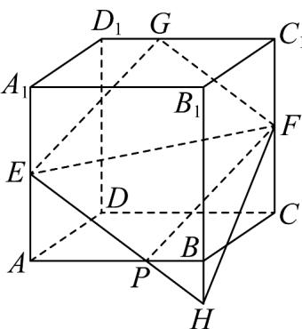

> [!faq]- 《专题15 空间点、直线、平面之间的位置关系（高效培优期中专项训练）数学人教A版高一必修第二册》官方解析
>
> > [!success]- **【答案】** C
>
> > [!note]- **【解析】**
> > 
> >
> > 在正方体中，根据正方体的性质可得平面 $ABB_{1}A_{1}$ 与平面 $DCC_{1}D_{1}$ 平行，利用面面平行的性质定理可得平面 $EFG$ 与它们的交线 $GF, EH$ 平行，所以过点 $E$ 作直线 $GF$ 的平行线 $EP$ 与 $B_{1}B$ 延长线交于一点，此交点即为平面 $EFG$ 与棱 $B_{1}B$ 所在直线交点 $H$ ，连接 $PF$ ，如图所示。所以四边形 $EPFG$ 是平行四边形，所以 $EP = FG$ ，又 $E$ ， $F$ 分别为 $AA_{1}$ ， $CC_{1}$ 的中点，所以 $AE = C_{1}F$ ，因为 $\angle EAP = \angle FC_{1}G = 90^{\circ}$ ，所以 $\triangle EAP \cong \triangle FC_{1}G$ ，所以 $AP = C_{1}G$ ，又因为 $\triangle EAP \sim \triangle HBP$ ，所以 $\frac{BH}{EA} = \frac{BP}{AP} = \frac{1}{2}$ ，所以 $BH = \frac{1}{2} AE = \frac{1}{4} AA_{1} = \frac{1}{4}$ 。
> >
> > 故选 **C**.
