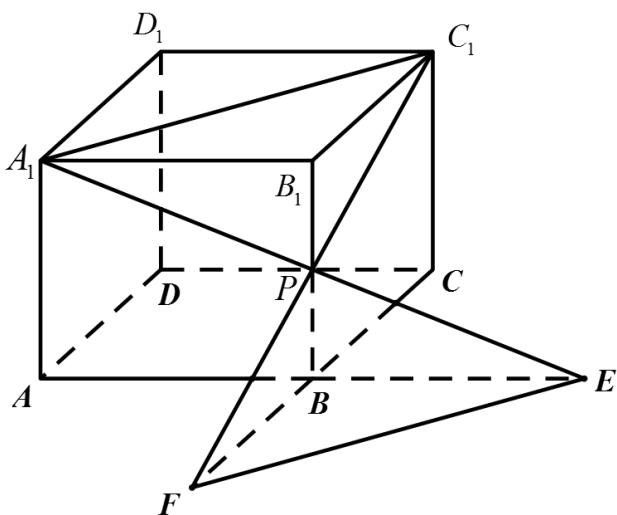

> [!faq]- 《专题15 空间点、直线、平面之间的位置关系（高效培优期中专项训练）数学人教A版高一必修第二册》官方解析
>
> > [!success]- **【答案】** A. $\sqrt{3}$ B. $\sqrt{5}$ C. $2\sqrt{5}$ D. 5
>
> > [!note]- **【解析】**
> > 解：因为平面 $A_{1}PC_{1}\cap AB=E$ ，平面 $A_{1}PC_{1}\cap BC=F$ ，
> >
> > 所以 $A_{1}P$ 与 AB 的交点即为点 E ，
> >
> > 延长线 $A_{1}P$ 与 $AB$ 的延长线交于点 $E$
> >
> > 因为 $AA_{1} //BP$ ，且 P 为 $BB_{1}$ 的中点，
> >
> > 所以 AB = AE = 4 ，
> >
> > 同理可得 $C_{1}P$ 与 CB 的延长线交于点 F ，
> >
> > 所以 BC = BF = 2 ，
> >
> > 如图所示，连接 EF ，
> >
> > 在长方体 $ABCD - A_{1}B_{1}C_{1}D_{1}$ 中，
> >
> > $$
> > \angle A B C = F B E = 9 0 ^ {\circ}
> > $$
> >
> > 则 $EF = \sqrt{BE^{2} + BF^{2}} = \sqrt{4 + 16} = 2\sqrt{5}$
> >
> > 故选：C.
> >
> > 
> >
> > 考点07异面直线的判定
