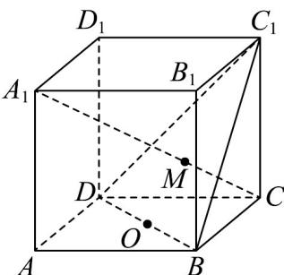
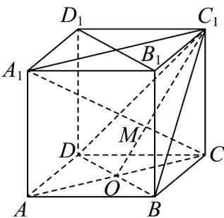

> [!faq]- 《专题15 空间点、直线、平面之间的位置关系（高效培优期中专项训练）数学人教A版高一必修第二册》官方解析
>
> > [!success]- **【答案】**  A. $AA_{1}$ 与 MO 是异面直线 B. $C_{1}$ , M, O 三点共线 C．三棱锥 M-BCD 的体积为 12 D． $M \in$ 平面 $BDD_{1}B_{1}$
>
> > [!note]- **【解析】**
> > 对于 $^{A}$ ：连接AC，由 $M\in A_{1}C\subset$ 平面 $ACA_{1}$ ， $O\in AC\subset$ 平面 $ACA_{1}$ ，所以 $AA_{1}$ 与OM共面，故 $^{A}$ 错
> >
> > 误；
> >
> > 对于 B：由 $M \in A_{1}C \subset$ 平面 $ACC_{1}A_{1}$ ， $M \in$ 平面 $BDC_{1}$ ， $O \in AC \subset$ 平面 $ACC_{1}A_{1}$ ， $O \in$ 平面 $BDC_{1}$
> >
> > 又平面 $ACC_{1}A_{1} \cap$ 平面 $BDC_{1}=OC_{1}$ ，所以 $M \in OC_{1}$ ，即 $C_{1}$ ，M，O 三点共线，故 B 正确；
> >
> > 对于 $^{C}$ ：由 $AC // A_{1}C_{1}$ ，所以 $\frac{OM}{C_{1}M} = \frac{CO}{A_{1}C_{1}} = \frac{1}{2}$ ，
> >
> > 所以 $V_{M-BCD}=\frac{1}{3}V_{C_{1}-BCD}=\frac{1}{3}\times\frac{1}{3}\times\frac{1}{2}\times6\times6\times6=12$ ，故 C 正确；
> >
> > 对于 D：平面 $BDD_{1}B_{1} \cap$ 平面 $BDC_{1} = BD$ ，又 $M \notin BD$ ，所以 $M \notin$ 平面 $BDD_{1}B_{1}$ ，故 D 错误。
> > 故选：BC.
> >
> > 
