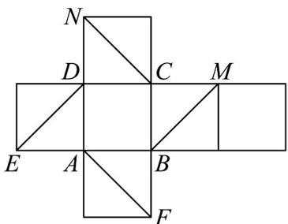
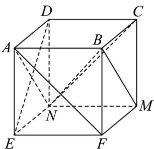

> [!faq]- 《专题15 空间点、直线、平面之间的位置关系（高效培优期中专项训练）数学人教A版高一必修第二册》官方解析
>
> > [!success]- **【答案】**  A. AF 与 CN 平行 B. BM || AN C. DE 与 CN 是相交直线 D. BM 与 DE 是异面直线
>
> > [!note]- **【解析】**
> > 将正方体的展开图还原为正方体 ABCD - EFMN ，如图所示，
> >
> > 
> >
> > 可得 AF 与 CN 是异面垂直， $^{A}$ 错误；
> >
> > BM 与 AN 平行， $^{B}$ 正确；
> >
> > $DE \subset$ 平面 ADNE， $N \in$ 平面 ADNE， $C \notin$ 平面 ADNE， $N \notin DE$
> >
> > 由异面直线定义可得，DE 与 CN 是异面直线， $^{C}$ 错误；
> >
> > BM 与 DE 是异面垂直， $^{D}$ 正确.
> >
> > 故选 **BD**.
