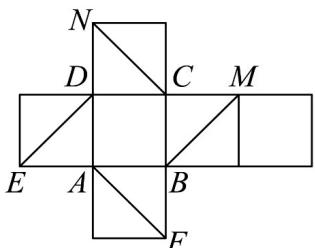
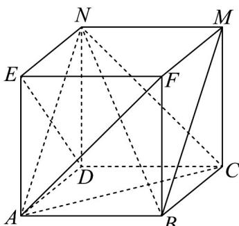

> [!faq]- 《专题15 空间点、直线、平面之间的位置关系（高效培优期中专项训练）数学人教A版高一必修第二册》官方解析
>
> > [!success]- **【答案】**  A. $BM$ 与 $AN$ 平行 B. $AF$ 与 $BM$ 是异面直线 C. $AF$ 与 $CN$ 相交 D. $BN$ 与 $DE$ 是异面直线
>
> > [!note]- **【解析】**
> > 把正方体的平面展开图还原原正方体如图，
> >
> > 
> >
> > 在正方体中，BM 与 AN 平行，故 A 正确；由异面直线定义可得，AF 与 BM 是异面直线，故 B 正确；AF 与 CN 是异面直线，故 C 错误；由异面直线定义可得，BN 与 DE 是异面直线，故 D 正确；
> >
> > 故选 **ABD**.
