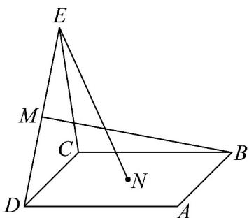
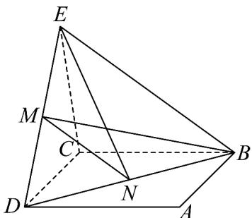
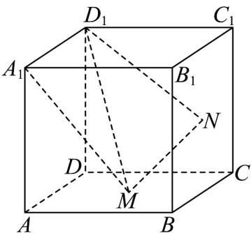
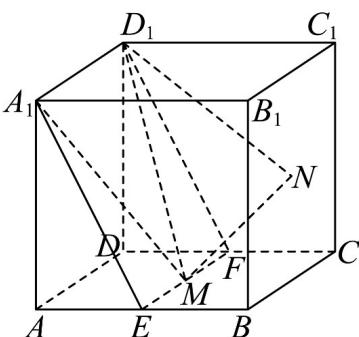
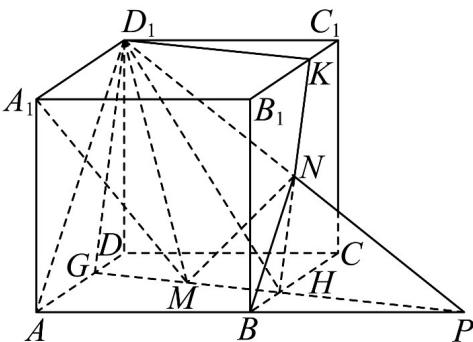

> [!faq]- 《专题15 空间点、直线、平面之间的位置关系（高效培优期中专项训练）数学人教A版高一必修第二册》官方解析
>
> > [!success]- **【答案】**  A. $AB$ 与 $DE$ B. $BC$ 与 $EN$ C. $CD$ 与 $BM$ D. $BM$ 与 $EN$
>
> > [!note]- **【解析】**
> > 在正方形 ABCD 中，AB // CD，
> > 所以 D 在平面 ABCD 内，D 不在直线 AB 上，
> > 又 E 不在平面 ABCD 内，所以 AB 与 DE 异面；
> > 因为 $BC \subset$ 平面 ABCD ，N 在平面 ABCD 内，N 不在直线 BC 上，
> > 又 E 不在平面 ABCD 内，所以 BC 与 EN 异面；
> > 因为 $CD \subset$ 平面 ABCD ，B 在平面 ABCD 内，B 不在直线 CD 上，
> > 又 M 不在平面 ABCD 内，所以 CD 与 BM 异面；
> >
> > 
> >
> > 连接 BD, BE, MN，因为点 N 为正方形 ABCD 的中心，又 M 是线段 ED 的中点，所以 MN // BE，所以 B, M, N, E 在平面 BDE 内，所以 BM 与 EN 不是异面直线·故选：D·
> >
> > 41. 正方体 $ABCD - A_{1}B_{1}C_{1}D_{1}$ 的棱长为 $a, M, N$ 分别是正方形 $ABCD, BCC_{1}B_{1}$ 的中心（如图所示）·则下列结论正确的是（）
> >
> > 【答案】
> >
> > 
> >
> > A. $A_{1}M // D_{1}N$
> >
> > B. $AB$ 与 $D_{1}N$ 共面
> >
> > C. 平面 $A_{1}D_{1}M$ 与该正方体所得的截面面积为 $\frac{\sqrt{5}}{2} a^{2}$
> >
> > D．平面 $D_{1}MN$ 将正方体分成前后两部分的体积比为2:1
> >
> > 【答案】BCD
> >
> > 【详解】在正方体 $ABCD-A_{1}B_{1}C_{1}D_{1}$ 中，过 M 作 $EF \parallel AD$ 分别交 AB, CD 于 E, F ，连接 $A_{1}E, D_{1}F$ ，则 $EF \parallel A_{1}D_{1}$
> >
> > 
> >
> > 对于 A， $A_{1}M \subset$ 平面 $A_{1}EFD_{1}$ ，点 $D_{1} \in$ 平面 $A_{1}EFD_{1}$ ，点 $D_{1} \notin A_{1}M$
> >
> > 又点 $N\notin$ 平面 $A_{1}EFD_{1}$
> >
> > 因此 $A_{1}M, D_{1}N$ 是异面直线， $^{A}$ 错误；
> >
> > 对于 C，四边形 $A_{1}EFD_{1}$ 是矩形，且是平面 $A_{1}D_{1}M$ 截该正方体所得的截面，而 M 为正方形 ABCD 的中心，则 E 是 AB 的中点， $A_{1}E=\frac{\sqrt{5}}{2}a$ ，矩形 $A_{1}EFD_{1}$ 的面积 $S=A_{1}D_{1}\cdot A_{1}E=\frac{\sqrt{5}}{2}a^{2}$ ，C 正确；
> >
> > 连接 $AD_{1}, BN$ ，矩形 $ABC_{1}D_{1}$ 是正方体 $ABCD - A_{1}B_{1}C_{1}D_{1}$ 的对角面，则 $BC_{1} // A_{1}D_{1}$ ，由 $N$ 为正方形 $BCC_{1}B_{1}$ 的中心，得点 $N$ 为 $BC_{1}$ 中点，因此 $BN // AD_{1}$ ，
> >
> > 
> >
> > 点 $A, B, N, D_{1}$ 共面，则 $AB$ 与 $D_{1}N$ 共面， $^{\mathrm{B}}$ 正确；
> >
> > 对于 D， $BN=\frac{1}{2}AD_{1}$ ，延长 $D_{1}N, AB$ 交于点 P，连接 PM 交 BC 于点 H，
> >
> > 延长 PM 交 AD 于 G，连接 $D_{1}G$ ，令直线 HK 交 $B_{1}C_{1}$ 于 K，连接 $D_{1}K$ ，
> >
> > 则四边形 $D_{1}GHK$ 是平面 $D_{1}MN$ 截正方体所得截面，
> >
> > 由 M, N 分别为正方形 ABCD， $BCC_{1}B_{1}$ 的中心，得 $C_{1}K + CH = a = DG + CH$ ，连接 $D_{1}H$ ，
> >
> > 多面体 $D_{1}C_{1}K - DCHG$ 的体积 $V_{1} = V_{D_{1} - CC_{1}KH} + V_{D_{1} - DCHG} = \frac{1}{3}\times \frac{1}{2} a^{2}\times a + \frac{1}{3}\times \frac{1}{2} a^{2}\times a = \frac{1}{3} a^{3}$
> >
> > 而正方体的体积 $V = a^{3}$ ，因此平面 $D_{1}MN$ 将正方体分成前后两部分的体积比为 $\frac{V - V_{1}}{V_{1}} = 2$ ，D 正确。
> >
> > 故选 **BCD**
