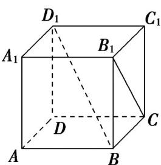

> [!faq]- 《专题15 空间点、直线、平面之间的位置关系（高效培优期中专项训练）数学人教A版高一必修第二册》官方解析
>
> > [!success]- **【答案】**  A. 平行 B. 相交 C. 异面 D. 以上都不是
>
> > [!note]- **【解析】**
> > 因为 $B_{1}C \subset$ 平面 $BCB_{1}$ ， $D_{1}B \cap$ 平面 $BCB_{1} = B$ ， $B \notin B_{1}C$ ，
> > 所以直线 $B_{1}C$ 与 $D_{1}B$ 是异面直线.
> > 故选：C
> >
> > ## 考点 08 空间中直线与平面的位置关系
