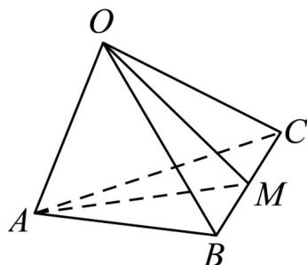

> [!faq]- 《专题15 空间点、直线、平面之间的位置关系（高效培优期中专项训练）数学人教A版高一必修第二册》官方解析
>
> > [!success]- **【答案】** A
>
> > [!note]- **【解析】**
> > 取 BC 的中点 M ，连接 OM 、 AM ，
> >
> > 可知点 B 、 C 到平面 OAM 的距离相等，所以平面 OAM 平分三棱锥的体积，
> >
> > 
> >
> > 因为 $OA \perp OB$ ， $OA \perp OC$ ， $OB \cap OC = O$ ， $OB$ 、 $OC \subset$ 平面 $OBC$ ，所以 $OA \perp$ 平面 $OBC$ ，且 $OM \subset$ 平面 $OBC$ ，则 $OA \perp OM$ ，
> >
> > 设 $OA = a$ ， $OB = b$ ， $OC = c$ ， $a > b > c$ ，则 $BC = \sqrt{OB^2 + OC^2} = \sqrt{b^2 + c^2}$
> >
> > 因为 $\triangle OBC$ 为直角三角形，则 $OM = \frac{1}{2} BC = \frac{1}{2}\sqrt{b^2 + c^2}$
> >
> > 所以 $S_{1}=\frac{1}{2}OA\cdot OM=\frac{1}{2}a\times\frac{1}{2}\sqrt{b^{2}+c^{2}}=\frac{\sqrt{a^{2}b^{2}+a^{2}c^{2}}}{4}$
> >
> > 同理可得： $S_{2}=\frac{\sqrt{a^{2}b^{2}+b^{2}c^{2}}}{4}$ ， $S_{3}=\frac{\sqrt{a^{2}c^{2}+b^{2}c^{2}}}{4}$ ，
> >
> > 因为 a > b > c ，所以， $a^{2}b^{2} > a^{2}c^{2} > b^{2}c^{2}$
> >
> > 则 $a^2 b^2 + a^2 c^2 > a^2 b^2 + b^2 c^2 > a^2 c^2 + b^2 c^2$ ，所以 $S_3 < S_2 < S_1$
> >
> > 故选 **A**.
