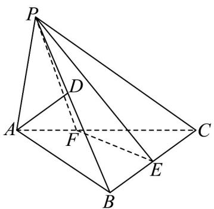

<!-- question-source:start -->
1. 如图，在三棱锥 $P - ABC$ 中，点 $D$ 、 $F$ 分别为棱 $PB$ ， $AC$ 上的点，且 $PD = BD$ ， $AF = \frac{1}{2} FC$ ， $E$ 为线段 $BC$ 上的点，若 $BE = \lambda BC$ ，且满足 $AD //$ 平面 $PEF$ ，则 $\lambda = (\quad)$

A. $\frac{1}{2}$ B. $\frac{2}{3}$ C. $\frac{1}{4}$ D. $\frac{1}{3}$
<!-- question-source:end -->

![[高中/课堂同步/题库/人教A版高中数学同步讲义(2026)/02_必修第二册/期中专项训练+期中模拟卷/专题17 空间直线、平面的平行-面面平行（高效培优期中专项训练）数学人教A版高一必修第二册/考点01_判断面面平行/questions/answers/Q00077322A1.md]]
