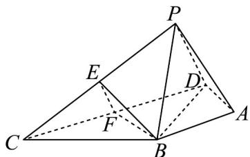

<!-- question-source:start -->
10．如图，在四棱锥 P-ABCD 中， $\triangle BCD$ 为等边三角形， $BD=2\sqrt{3}$ ， $PA=\sqrt{3}$ ，AB=AD=PB=PD， $\angle BAD = 120^{\circ}$ ，点 E，F 分别为 PC，CD 的中点.

(1)求证：平面 $BEF //$ 平面 PAD；

(2)求二面角 P-BD-A 的余弦值.
<!-- question-source:end -->

![[高中/课堂同步/题库/人教A版高中数学同步讲义(2026)/02_必修第二册/期中专项训练+期中模拟卷/专题17 空间直线、平面的平行-面面平行（高效培优期中专项训练）数学人教A版高一必修第二册/考点01_判断面面平行/questions/answers/Q00077330A1.md]]
