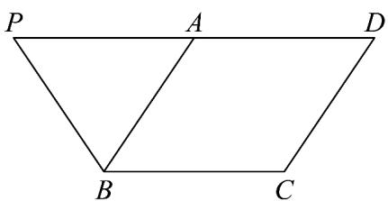
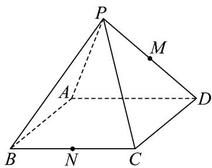

<!-- question-source:start -->
15．如图（1），在梯形 $PBCD$ 中， $BC \parallel PD$ ， $PD = 2BC$ ， $A$ 是 $PD$ 中点，现将 $\triangle ABP$ 沿 $AB$ 折起得图（2），点 $M$ 是 $PD$ 的中点，点 $N$ 是 $BC$ 的中点．

(1)

(1)求证：MN//平面PAB；

(2)在线段 $PC$ 上是否存在一点 $E$ ，使得平面 $EMN \parallel$ 平面 $PAB$ ？若存在，请指出点 $E$ 的位置并证明你的结论；若不存在，请说明理由。
<!-- question-source:end -->

![[高中/课堂同步/题库/人教A版高中数学同步讲义(2026)/02_必修第二册/期中专项训练+期中模拟卷/专题17 空间直线、平面的平行-面面平行（高效培优期中专项训练）数学人教A版高一必修第二册/考点01_判断面面平行/questions/answers/Q00077334A1.md]]
