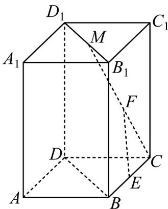

<!-- question-source:start -->
18. 如图，在四棱柱 $ABCD - A_{1}B_{1}C_{1}D_{1}$ 中，点 $M$ 是线段 $B_{1}D_{1}$ 上的一个动点， $E, F$ 分别是 $BC, CM$ 的中点。

(1) 求证： $EF \parallel$ 平面 $BDD_{1}B_{1}$ ；

(2) 在棱 $CD$ 上是否存在一点 $G$ ，使得平面 $GEF //$ 平面 $BDD_1B_1$ ？若存在，求出 $\frac{CG}{GD}$ 的值；若不存在，请说明理由·
<!-- question-source:end -->

![[高中/课堂同步/题库/人教A版高中数学同步讲义(2026)/02_必修第二册/期中专项训练+期中模拟卷/专题17 空间直线、平面的平行-面面平行（高效培优期中专项训练）数学人教A版高一必修第二册/考点01_判断面面平行/questions/answers/Q00077336A1.md]]
