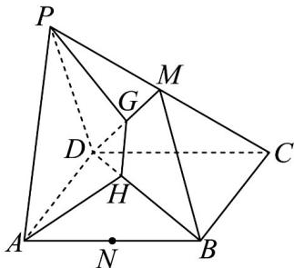

<!-- question-source:start -->
22. 如图，四边形 $ABCD$ 是平行四边形，点 $P$ 是平面 $ABCD$ 外一点已知 $M$ ， $N$ 分别是 $PC$ ， $AB$ 的中点，在 $DM$ 上取一点 $G$ ，过 $G$ 和 $AP$ 作平面交平面 $BDM$ 于 $HG$ .

(1)求证： $MN / /$ 平面PAD；

(2)求证： $AP / / HG$
<!-- question-source:end -->

![[高中/课堂同步/题库/人教A版高中数学同步讲义(2026)/02_必修第二册/期中专项训练+期中模拟卷/专题17 空间直线、平面的平行-面面平行（高效培优期中专项训练）数学人教A版高一必修第二册/考点01_判断面面平行/questions/answers/Q00077339A1.md]]
