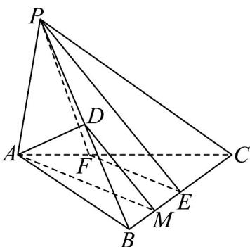

> [!faq]- 《专题17 空间直线、平面的平行-面面平行（高效培优期中专项训练）数学人教A版高一必修第二册》官方解析
>
> > [!success]- **【答案】** A
>
> > [!note]- **【解析】**
> > 如图，取 $BE$ 的中点 $M$ ，连接 $DM, AM$ 由 $PD = BD$ ，所以 $D$ 为 $PB$ 的中点，又 $M$ 为 $BE$ 的中点，所以 $MD // PE$ ， $MD \ddot{E}$ 平面 $PEF$ ， $PE \subset$ 平面 $PEF$ ，所以 $MD //$ 平面 $PEF$ ，又 $AD //$ 平面 $PEF$ ，且 $ADI MD = D$ ， $AD, MD \subset$ 平面 $ADM$ ，所以平面 $PEF //$ 平面 $ADM$ ，由 $AM \subset$ 平面 $ADM$ ，所以 $AM //$ 平面 $PEF$ 又 $AM \subset$ 平面 $ABC$ ，平面 $ABC \cap$ 平面 $PEF = EF$ ，所以 $AM // EF$ 又 $AF = \frac{1}{2} FC$ ，所以 $ME = \frac{1}{2} EC$ ，所以 $\overline{BE} = \frac{1}{2} BC$ ，故 $\lambda = \frac{1}{2}$
> >
> > 
> >
> > 故选 **A**
