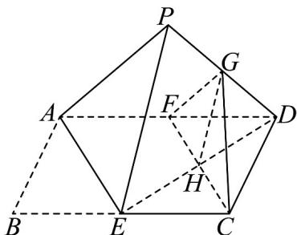

> [!faq]- 《专题17 空间直线、平面的平行-面面平行（高效培优期中专项训练）数学人教A版高一必修第二册》官方解析
>
> > [!success]- **【答案】**  A．翻折过程中，始终有平面 $PAE//$ 平面 $GFC$ B．翻折过程中， $CG$ 的长是定值 C．若 $AB = BE$ ，则 $AE \perp ED$ D．存在某个位置，使得 $CG \perp AP$
>
> > [!note]- **【解析】**
> > 因为 E，F 为中点，则 $CE \parallel DF, CE = DF$ ，所以四边形 CEFD 是平行四边形，所以 H 是 ED 的中点，所以 FG // AP，
> > 又 $FG \not\subset$ 平面 PAE， $AP \subset$ 平面 PAE，所以 FG // 平面 PAE，
> >
> > 同理 GH // 平面 PAE，
> >
> > 又 $GH \cap FG = G$ ，所以平面 PAE // 平面 GFC，故 A 正确；
> >
> > 因为 $\angle GFH = \angle PAE$ （定值）， $FG = \frac{1}{2} AP$ （定值）， $FC = AE$ （定值），
> >
> > 在 $\triangle GFC$ 中由余弦定理可知 CG 的长是定值，故 B 正确；
> >
> > 若 $AB = BE$ ，则 $FA = FE = FD$ ，所以 $\angle AED = 90^{\circ}$ ，所以 $AE\perp ED$ ，故C正确；
> >
> > 因为 $\angle APE = 90^{\circ}$ ，所以 $\angle FGH = 90^{\circ}$ ，所以 $GH \perp GF$ ，
> >
> > 因为 GF, GH, GC 在同一平面内，所以 GC 不可能垂直于 GF，
> >
> > 因为 $GF \parallel AP$ ，所以 GC 不可能垂直于 AP，故 D 错误·
> >
> > 故选 **ABC**.
