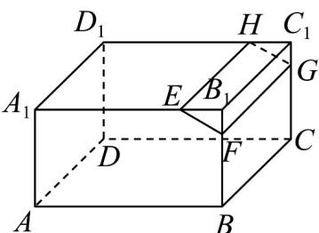
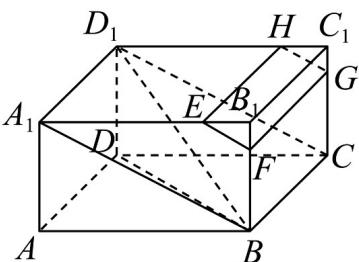

> [!faq]- 《专题17 空间直线、平面的平行-面面平行（高效培优期中专项训练）数学人教A版高一必修第二册》官方解析
>
> > [!success]- **【答案】**  A $BD_{1}//GH$ B. $BD$ 与 $EF$ 异面 C. $EH \parallel$ 平面ABCD D．平面 $EFGH//$ 平面 $A_{1}BCD_{1}$
>
> > [!note]- **【解析】**
> > 如下图所示，连接 $A_{1}B, D_{1}C, BD, BD_{1}$
> >
> > 
> >
> > 根据题意，由 $\frac{A_1E}{EB_1} = \frac{BF}{FB_1} = 2$ 可得， $EF / / A_{1}B$ ，且 $\frac{EF}{A_1B} = \frac{B_1F}{BB_1} = \frac{B_1E}{A_1B_1} = \frac{1}{3}$
> >
> > 同理可得 $GH//CD_1, FG//BC$ ，且 $\frac{GH}{CD_1} = \frac{1}{3}$ ；
> >
> > 由 $GH \parallel CD_{1}$ ，而 $CD_{1} \cap BD_{1} = D_{1}$ ，所以 $BD_{1}$ 不可能平行于 GH，即 A 错误；
> >
> > 易知 BD 与 EF 不平行，且不相交，由异面直线定义可知，BD 与 EF 异面，即 B 正确；
> >
> > 在长方体 $ABCD - A_{1}B_{1}C_{1}D_{1}$ 中 $A_{1}B \parallel CD_{1}, A_{1}B = CD_{1}$
> >
> > 所以 $EF \parallel GH, EF = GH$ ，即四边形 EFGH 为平行四边形；
> >
> > 所以 $EH // FG$ ，又 $BC // FG$ ，所以 $EF // BC$ ；
> >
> > $EH \not\subset$ 平面 $ABCD$ ， $BC \subset$ 平面 $ABCD$ ，
> >
> > 所以 $EH \parallel$ 平面 $ABCD$ ，即 $^{C}$ 正确；
> >
> > 由 $EF // A_1B$ ， $EF \nsubseteq$ 平面 $A_1BCD_1$ ， $A_1B \subset$ 平面 $A_1BCD_1$ ，所以 $EF //$ 平面 $A_1BCD_1$ ；
> >
> > 又 $BC // FG$ ， $FG \notin$ 平面 $A_{1}BCD_{1}$ ， $BC \subset$ 平面 $A_{1}BCD_{1}$ ，所以 $FG //$ 平面 $A_{1}BCD_{1}$ ；
> >
> > 又 $EF \cap FG = F$ ，且 $FG, EF$ 平面 EFGH，
> >
> > 所以平面 $EFGH \parallel$ 平面 $A_{1}BCD_{1}$ ，即 $\mathbf{D}$ 正确·
> >
> > 故选 **A**
