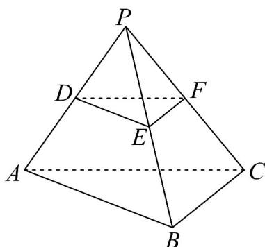

> [!faq]- 《专题17 空间直线、平面的平行-面面平行（高效培优期中专项训练）数学人教A版高一必修第二册》官方解析
>
> > [!success]- **【答案】**  A. $BC_{\parallel}$ 平面DEF B. 平面 $DEF$ $\parallel$ 平面 $ABC$ C. 三棱锥 $P - DEF$ 与三棱锥 $P - ABC$ 的体积比为 $1:4$ D. 异面直线 $DE$ 与 $BC$ 所成角为 $60^{\circ}$
>
> > [!note]- **【解析】**
> > 对于 $^{A}$ ，易得 $EF \parallel BC$ ， $EF \subset$ 平面 DEF， $BC \notin$ 平面 DEF，则 $BC \parallel$ 平面 DEF， $^{A}$ 正确；对于 $^{B}$ ，易得 $DE \parallel AB$ ， $DE \subset$ 平面 DEF， $AB \notin$ 平面 DEF，则 $AB \parallel$ 平面 DEF，又由 $^{A}$ 选项得 $BC \parallel$ 平面 DEF，
> >
> > $AB\cap BC = B$ ， $AB,BC\subset$ 平面ABC，则平面DEF $\|$ 平面ABC，B正确；
> >
> > 对于 $C$ ，易得三棱锥 $P-DEF$ 与三棱锥 $P-ABC$ 的高之比为 $1:2$ ，又 $S_{\triangle DEF}:S_{\triangle ABC}=1:4$ ，
> >
> > 则三棱锥 P-DEF 与三棱锥 P-ABC 的体积比为 1:8，C 错误；
> >
> > 对于 $^{D}$ ，易得 $DE \parallel AB$ ，则 $\angle ABC$ 或其补角即为异面直线 DE 与 BC 所成角，不确定 $\angle ABC$ 的大小，则 $^{D}$ 错误·故选：AB.
> >
> > 考点02 证明面面平行
