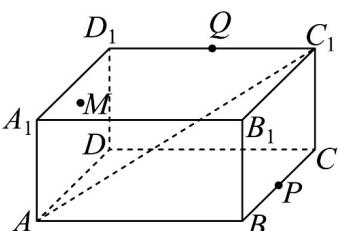
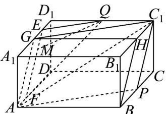

> [!faq]- 《专题17 空间直线、平面的平行-面面平行（高效培优期中专项训练）数学人教A版高一必修第二册》官方解析
>
> > [!success]- **【答案】**  A. 2 B. $\sqrt{5}$ C. $2\sqrt{2}$ D. $\sqrt{10}$
>
> > [!note]- **【解析】**
> > 在长方体 $ABCD - A_{1}B_{1}C_{1}D_{1}$ 中，取 $A_{1}D_{1}, B_{1}C_{1}$ 的中点 $G, H$ ，连接 $AG, GH, BH$
> >
> > 
> >
> > 由点 P 为 BC 的中点，得 $C_{1}H \parallel BP, C_{1}H = BP$ ，则四边形 $BPC_{1}H$ 是平行四边形， $BH \parallel C_{1}P$ ，又 $GH \parallel A_{1}B_{1} \parallel AB, GH = A_{1}B_{1} = AB$ ，则四边形 ABHG 是平行四边形，
> >
> > 于是 $AG \parallel BH \parallel C_{1}P$ ，取 $GD_{1}$ 中点 E，在 AD 上取点 F，使得 AF = GE，连接 EF, QE, QF，
> >
> > 而 AF // GE，则四边形 AGEF 为平行四边形，EF // AG，而 $AG \subset$ 平面 $APC_{1}$ ， $EF \not\subset$ 平面 $APC_{1}$ ，
> >
> > 于是 $EF \parallel$ 平面 $APC_{1}$ ，由 Q 为 $C_{1}D_{1}$ 的中点，得 $QE \parallel C_{1}G$ ，而 $C_{1}G \subset$ 平面 $APC_{1}$ ， $QE \not\subset$ 平面 $APC_{1}$ ，则 $QE / /$ 平面 $APC_{1}$ ，又 $EF\cap QE = E,EF,QE\subset$ 平面 $QEF$ ，因此平面 $QEF / /$ 平面 $APC_{1}$
> >
> > 由直线 $QM / /$ 平面 $APC_{1}$ ，点 $M\in$ 平面 $ADD_{1}A_{1}$ ，则点 $M$ 在平面 $QEF$ 与平面 $ADD_{1}A_{1}$ 的交线上，
> >
> > 从而点 $M$ 的轨迹是线段 $EF$ ，而 $EF = AG = \sqrt{A_1G^2 + A_1A^2} = 2\sqrt{2}$
> >
> > 所以点 M 的轨迹长度为 $2\sqrt{2}$ .
> >
> > 故选 **C**
