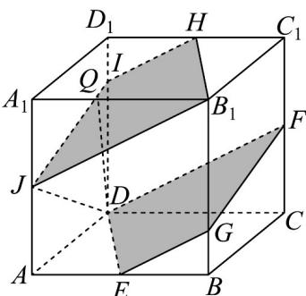
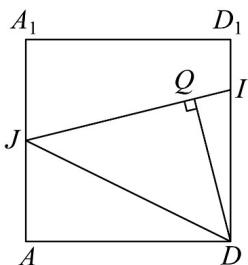

> [!faq]- 《专题17 空间直线、平面的平行-面面平行（高效培优期中专项训练）数学人教A版高一必修第二册》官方解析
>
> > [!success]- **【答案】** A. $\sqrt{19}$ B. $2\sqrt{5}$ C. $\frac{3\sqrt{35}}{5}$ D. $\frac{12\sqrt{17}}{17}$
>
> > [!note]- **【解析】**
> > 取 $BB_{1}$ 上靠近点 B 的四等分点 G ，连接 EG 、 FG ，
> >
> > 由 $E$ 是棱 $AB$ 的中点，点 $F$ 是棱 $CC_{1}$ 的中点，易得 $EG // DF$ ，则 $EG \subset$ 平面 $DEF$
> >
> > 
> >
> > 取 $C_1D_1$ 、 $A_{1}A$ 中点 $H$ 、 $J$ ，取 $DD_{1}$ 上靠近点 $D_{1}$ 的四等分点 $I$ ，连接 $B_{1}H$ 、 $HI$ 、 $IJ$ 、 $JB_{1}$
> >
> > 由正方体的性质易得 $HI // JB_{1}$ ， $JB_{1} // EG$ ，则 $HI // EG$
> >
> > 又 $HI \notin$ 平面 $DEF$ ， $EG \subset$ 平面 $DEF$ ，所以 $HI //$ 平面 $DEF$ ，
> >
> > 同理，IJ//平面DEF，
> >
> > 
> >
> > 又 $IJ \cap IH \subset I$ ， $IJ$ ， $IH \subset$ 平面 $HIJB_{1}$ ，故平面 $HIJB_{1} //$ 平面 $DEF$ ，
> >
> > 又 $PB_{1} //$ 平面DEF， $P \in$ 平面 $AA_{1}DD_{1}$ ，故 $P \in IJ$ ，即点 $P$ 的轨迹为线段 $IJ$
> >
> > 设点 D 到 IJ 的距离为 d，有 $S_{\triangle DIJ} = \frac{1}{2} \times 4 \times 3 = \frac{1}{2} \sqrt{1 + 4^{2}} \times d$ ，
> >
> > 故 $d = \frac{12}{\sqrt{17}} = \frac{12\sqrt{17}}{17}$ ，故 $PD$ 的长度最小值为 $\frac{12\sqrt{17}}{17}$
> >
> > 故选：D.
> >
> > 考点03补全面面平行的条件
