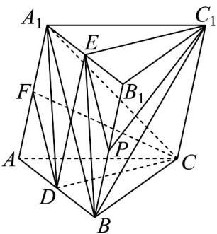

> [!faq]- 《专题17 空间直线、平面的平行-面面平行（高效培优期中专项训练）数学人教A版高一必修第二册》官方解析
>
> > [!success]- **【答案】** (1)证明见解析 (2)证明见解析
>
> > [!note]- **【解析】**
> > （1）连接 $DE$ ，由题意知， $DB = A_{1}E$ ， $DB \parallel A_{1}E$
> >
> > 即四边形 $DBEA_{1}$ 为平行四边形，所以 $DA_{1} \parallel BE$
> >
> > $DA_{1} \notin$ 平面 $BEC_{1}$ , $BE \subset$ 平面 $BEC_{1}$ , 所以 $DA_{1} \parallel$ 平面 $BEC_{1}$
> >
> > 同理，四边形 $DEC_{1}C$ 为平行四边形，所以 $DC \parallel EC_{1}$
> >
> > 因为 $DC \notin$ 平面 $BEC_{1}$ , $CE_{1} \subset$ 平面 $BEC_{1}$
> >
> > 所以 $DC \parallel$ 平面 $BEC_{1}$
> >
> > 又 $DC \cap DA_{1} = D$ ， $DC$ ， $DA_{1} \subset$ 平面 $A_{1}DC$
> >
> > 所以平面 $A_{1}DC \parallel$ 平面 $BEC_{1}$
> >
> > (2) 如图，取 $BB_{1}$ 的中点 P，连接 EP， $PC_{1}$ ， $A_{1}B$
> >
> > 由（1）知 $EC_{1} / / CD$ ，又 $E, P$ 分别是 $A_{1}B_{1}, BB_{1}$ 的中点，可得 $EP / / A_{1}B$
> >
> > 因为 $F, D$ 分别为 $AA_{1}, AB$ 的中点，所以 $FD \parallel A_{1}B$ ，则 $EP \parallel FD$ ，
> >
> > 又 $EP \cap C_{1}E = E, FD \cap CD = D$
> >
> > $EP,EC_{1}\subset$ 平面 $EC_{1}P$ ，FD,CD⊂平面FCD，
> >
> > 所以平面 $EC_{1}P / /$ 平面 $DCF$ .故结论得证.
> >
> > (2)
> > 
