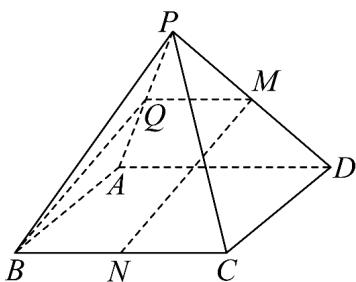
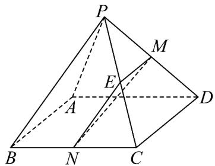
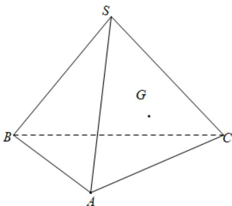
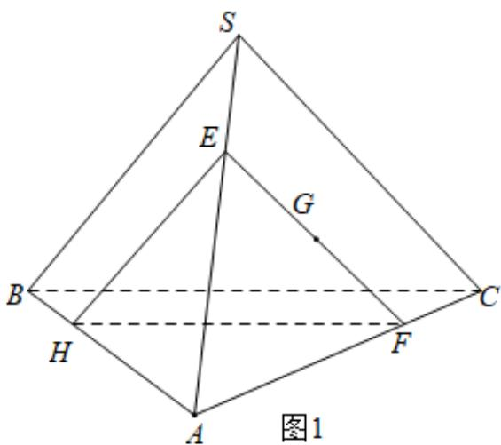
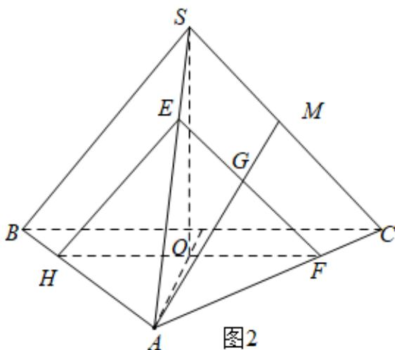

> [!faq]- 《专题17 空间直线、平面的平行-面面平行（高效培优期中专项训练）数学人教A版高一必修第二册》官方解析
>
> > [!success]- **【答案】** $^{(1)}$ 证明见解析 $^{(2)}$ 存在，E为PC中点，证明见解析
>
> > [!note]- **【解析】**
> > $(1)$ 取 AP 的中点 Q，连接 MQ，BQ，
> >
> > 
> >
> > 因为 M, Q 分别为 PD, PA 的中点,
> >
> > 所以 $MQ // AD$ ， $MQ = \frac{1}{2} AD$
> >
> > 又因为 $N$ 为 $BC$ 的中点，
> >
> > 所以 $BN // AD$ ， $BN = \frac{1}{2} AD$ 。
> >
> > 所以 $MQ // BN$ ， $MQ = BN$
> >
> > 所以四边形 $MNBQ$ 为平行四边形，所以 $MN // BQ$
> >
> > 又因为 $MN \not\subset$ 平面 PAB， $BQ \subset$ 平面 PAB，
> >
> > 所以 $MN / /$ 平面 $PAB$ .
> >
> > (2) 存在点 E，当 E 为 PC 中点时，平面 EMN // 平面 PAB。
> >
> > 证明如下：由图（1）因为 A 是 PD 中点， $BC \parallel PD$ ，PD = 2BC，
> >
> > 所以 BC // AD 且 BC = AD，
> >
> > 所以四边形 $ABCD$ 是平行四边形，所以 $AB // CD$
> >
> > 因为 E, M 分别为 PC, PD 中点, 所以 EM // CD,
> >
> > 所以 EM // AB ，
> >
> > 因为 $AB \subset$ 平面 PAB，EM $\not\subset$ 平面 PAB，
> >
> > 所以 EM // 平面 PAB，
> >
> > 同理可知 $EN / /$ 平面 $PAB$ ，又因为 $EM \cap EN = E, EM \subset$ 平面 $EMN, EN \subset$ 平面 $EMN$
> >
> > 所以平面 $EMN //$ 平面 $PAB$ .
> >
> > 
> >
> > 16. 一块三棱锥形木块如图所示，点 $G$ 是 $\triangle SAC$ 的重心，过点 $G$ 将木块锯开，使截面平行于侧面 $SBC$ .
> >
> > 
> >
> > (1)画出截面与木块表面的交线，并说明理由；
> >
> > (2)若 $\mathrm{V}ABC$ 为等边三角形， $SA = SB = SC = \frac{\sqrt{2}}{2} AB = 3$ ，求夹在截面与平面 $SBC$ 之间的几何体的体积
> >
> > 【答案】(1)答案见解析；
> >
> > (2) $\frac{19}{6}$
> >
> > 【详解】（1）解：过点 $G$ 作 $EF // SC$ 交 $SA, AC$ 于 $E, F$ 点，过点 $F$ 作 $EH // BS$ 交 $AB$ 于 $H$ ，则平面 $SBC //$ 平面 $EFH$ ， $\triangle EFH$ 边所在直线即为所画线·理由如下：
> >
> > 因为 $EF // SC$ ， $EF \notin$ 平面 $SBC$ ， $SC \subset$ 平面 $SBC$ ，所以 $EF //$ 平面 $SBC$
> >
> > 因为 $EH // BS$ ， $EH \notin$ 平面 $SBC$ ， $SB \subset$ 平面 $SBC$ ，所以 $EH //$ 平面 $SBC$
> >
> > 因为 $EF \cap EH = E, EF, EH \subset$ 平面 $EFH$
> >
> > 所以平面 SBC // 平面 EFH ·
> >
> > 
> >
> > (2) 解：因为 VABC 为等边三角形， $SA = SB = SC = \frac{\sqrt{2}}{2} AB = 3$
> >
> > 所以三棱锥 S-ABC 为正三棱锥，
> >
> > 所以点 S 在平面 ABC 内的射影为 VABC 的中心 O，则 $SO \perp$ 平面 ABC，如图 2
> >
> > 连接 AO，由 VABC 为等边三角形，VABC 的中心为 O， $AB = 3\sqrt{2}$
> >
> > 所以 $AO = 3\sqrt{2} \times \frac{\sqrt{3}}{2} \times \frac{2}{3} = \sqrt{6}$
> >
> > 所以三棱锥 $S - ABC$ 的高为 $\sqrt{SA^2 - OA^2} = \sqrt{3^2 - (\sqrt{6})^2} = \sqrt{3}$
> >
> > 所以三棱锥 $S - ABC$ 的体积为 $V_{S - ABC} = \frac{1}{3} S_{\triangle ABC}h = \frac{1}{3}\times \frac{\sqrt{3}}{4}\times (3\sqrt{2})^2\times \sqrt{3} = \frac{9}{2}$
> >
> > 连接 $AG$ 并延长，交 $SC$ 于点 $M$
> >
> > 因为点 $G$ 是 $\triangle SAC$ 的重心，所以 $\frac{AG}{AM} = \frac{2}{3}$ ，所以 $\frac{S_{\triangle EFH}}{S_{\triangle SBC}} = \left(\frac{AG}{AM}\right)^2 = \frac{4}{9}$
> >
> > 所以 $\frac{V_{A - EFH}}{V_{A - SBC}} = \left(\frac{2}{3}\right)^3 = \frac{8}{27}$
> >
> > 所以， $V_{A-EFH}=\frac{8}{27}V_{A-SBC}=\frac{8}{27}V_{S-ABC}=\frac{8}{27}\times\frac{9}{2}=\frac{4}{3}$
> >
> > 所以，截面与平面 SBC 之间的几何体的体积为 $V_{S-ABC}-V_{A-EFH}=\frac{9}{2}-\frac{4}{3}=\frac{19}{6}$
> >
> > 
