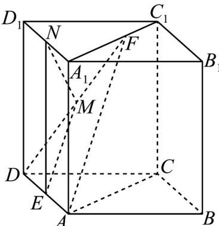

> [!faq]- 《专题17 空间直线、平面的平行-面面平行（高效培优期中专项训练）数学人教A版高一必修第二册》官方解析
>
> > [!success]- **【答案】** （1）证明见解析；（2）存在， $\frac{D_{1}N}{NA_{1}}=1$
>
> > [!note]- **【解析】**
> > （1）连接 $AF$ ，因为 $\mathrm{E},\mathrm{M}$ 为AD,DF的中点，所以 $EM//AF$
> >
> > 
> >
> > 又 $EM \notin$ 平面 $AC_{1}$ ， $AF \subset$ 平面 $AC_{1}$ ，故 $EM \parallel$ 平面 $AC_{1}$ .
> >
> > (2) 取 $A_{1}D_{1}$ 中点 $N$ ，连接 $EN$ ， $NM$ ，则 $EN // AA_{1}$ ， $EN \not\subset$ 平面 $AC_{1}$ ， $AA_{1} \subset$ 平面 $AC_{1}$ ，故 $EN //$ 平面 $AC_{1}$ ，又 $EM //$ 平面 $AC_{1}$ ，且 $EN$ ， $EM$ 是平面 $NEM$ 内两条相交直线，
> >
> > 故平面 NEM // 平面 $ACC_{1}A_{1}$
> >
> > 因此存在棱 $A_{1}D_{1}$ 中点 $N$ ，即 $\frac{D_1N}{NA_1} = 1$ 时满足题意
