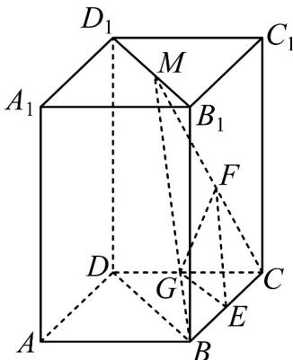

> [!faq]- 《专题17 空间直线、平面的平行-面面平行（高效培优期中专项训练）数学人教A版高一必修第二册》官方解析
>
> > [!success]- **【答案】** （1）证明见解析；（2）存在； $\frac{CG}{GD}=1$
>
> > [!note]- **【解析】**
> > 证明：(1)连接 $BM$ ，如下图所示，
> >
> > ∵ BE = EC, CF = FM, ∴ EF // BM
> >
> > 又 $EF \not\subset$ 平面 $BDD_{1}B_{1}$ ， $BM \subset$ 平面 $BDD_{1}B_{1}$ ，
> >
> > ∴EF // 平面 $BDD_{1}B_{1}$ ;
> >
> > (2) 当 G 为棱 CD 中点时，平面 $GEF \parallel$ 平面 $BDD_{1}B_{1}$
> >
> > 理由如下：
> >
> > ∵ E 为 BC 中点，∴ EG // BD，
> >
> > 又 $EG \notin$ 平面 $BDD_{1}B_{1}$ ， $BD \subset$ 平面 $BDD_{1}B_{1}$
> >
> > $\therefore EG // 平面 BDD_{1}B_{1}$ ，又由（1） $EF // 平面 BDD_{1}B_{1}$
> >
> > $EG \cap EF = E$ ，∴平面 $GEF //$ 平面 $BDD_{1}B_{1}$ ，且 $\frac{CG}{GD} = 1$
> >
> > 
> >
> > 考点 04 面面平行证明线线平行
