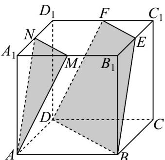

> [!faq]- 《专题17 空间直线、平面的平行-面面平行（高效培优期中专项训练）数学人教A版高一必修第二册》官方解析
>
> > [!success]- **【答案】**  A. $MN\parallel EF$ B. $EF\parallel BD$ C. $AN\parallel DF$ D. $BE\parallel$ 平面 $AMN$
>
> > [!note]- **【解析】**
> > 因为平面 $AMN \parallel$ 平面 $EFDB$ ，
> >
> > 平面 $A_{1}B_{1}C_{1}D_{1}$ 与平面 EFDB 和平面 AMN 的都相交，MN, EF 是交线，
> >
> > 所以 $MN\parallel EF$ ，故 $\mathsf{A}$ 正确；
> >
> > 因为长方体 $ABCD - A_{1}B_{1}C_{1}D_{1}$
> >
> > 所以平面 $A_{1}B_{1}C_{1}D_{1} //$ 平面ABCD，而平面EFDB与这两个平行平面的都相交，
> >
> > $EF, BD$ 是交线，所以 $EF \parallel BD$ ，故 $^{B}$ 正确，
> >
> > $AN \subset$ 平面 $ADD_{1}A_{1}, DF \cap$ 平面 $ADD_{1}A_{1} = D$ ，且 $D$ 不在直线 $AN$ 上，所以 $AN$ 与 $DF$ 不平行，故 $^{C}$ 错误；设平面 $DBEF \cap$ 平面 $ADD_{1}A_{1} = l$ ，则由平面 $ADD_{1}A_{1} //$ 平面 $BCC_{1}B_{1}$ 结合面面平行的性质可得 $l // BE$ ，
> >
> > 由平面 $AMN \parallel$ 平面 $EFDB$ 可得 $AN \parallel l$ ，所以 $BE \parallel AN$ ，
> >
> > 又因为 $AN \subset$ 面 $AMN$ , $BE \notin$ 面 $AMN$ ,
> >
> > 所以 $BE \parallel$ 平面 $AMN$ ，
> >
> > 故 $^{D}$ 正确·
> >
> > 故选 **ABD**
