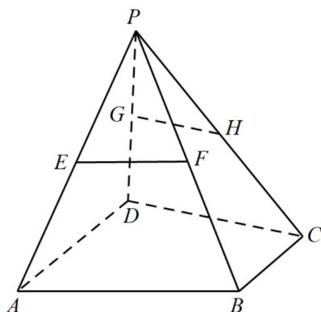

<!-- question-source:start -->
33. 如图，在四棱锥 $P - ABCD$ 中， $BC \parallel$ 平面 $PAD$ ， $AD \neq BC$ ， $E, F, H, G$ 分别是棱 $PA, PB, PC$ ， $PD$ 的中点。

(1)求证： $BC\parallel AD$

(2) 判断直线 $EF$ 与直线 $GH$ 的位置关系，并说明理由。
<!-- question-source:end -->

![[高中/课堂同步/题库/人教A版高中数学同步讲义(2026)/02_必修第二册/期中专项训练+期中模拟卷/专题17 空间直线、平面的平行-面面平行（高效培优期中专项训练）数学人教A版高一必修第二册/考点06空间平行的转化/questions/answers/Q00077349A1.md]]
