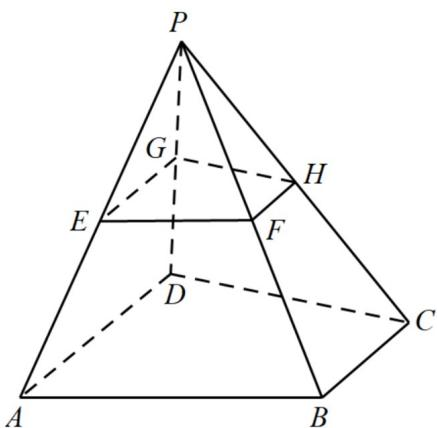
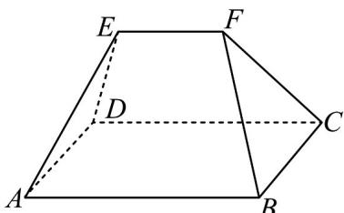
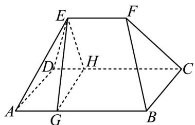
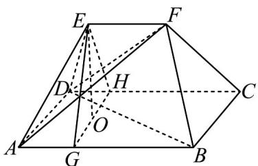
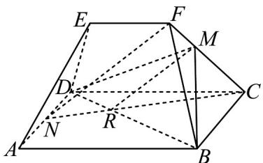
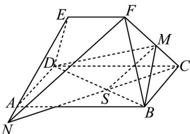
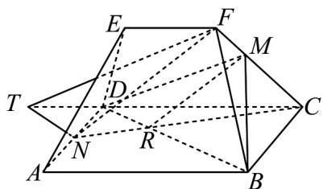
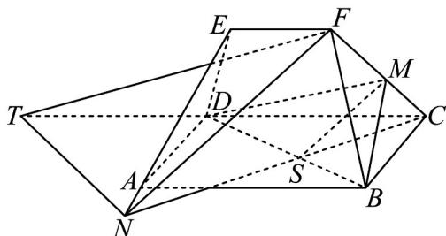

> [!faq]- 《专题17 空间直线、平面的平行-面面平行（高效培优期中专项训练）数学人教A版高一必修第二册》官方解析
>
> > [!success]- **【答案】** (1)证明见解析； (2)直线 EF 与直线 GH 相交，理由见解析.
>
> > [!note]- **【解析】**
> > （1）解：因为 $BC //$ 平面 $PAD$ ， $BC \subset$ 平面 $ABCD$ ，平面 $PAD \cap$ 平面 $ABCD = AD$ ，所以 $BC //AD$ .
> >
> > (2) 解：直线 EF 与直线 GH 相交，理由如下：
> >
> > 连接EG, FH，
> >
> > 因为 E, G 分别是棱 PA, PD 的中点，
> >
> > 所以 $EG // AD, EG = \frac{1}{2} AD$ ，同理可证： $FH // BC, FH = \frac{1}{2} BC$ ，
> >
> > 因为 BC // AD ，所以 EG // FH ，
> >
> > 所以 E, F, H, G 四点共面，
> >
> > 因为 $AD \neq BC$ ，所以 $EG \neq FH$ ，
> >
> > 所以 EF 与 GH 不平行，即 EF 与 GH 相交·
> >
> > 
> >
> > 34．中国古代数学名著《九章算术》中记载：“刍（chú）甍（méng）者，下有袤有广，而上有袤无广·刍，草也．甍，屋盖也．”翻译为“底面有长有宽为矩形，顶部只有长没有宽为一条楼．刍字面意思为茅草屋顶．”现有一个刍如图所示，四边形ABCD为正方形，四边形ABFE，CDEF为两个全等的等腰梯形， $AB = 4$ ， $EF // AB$ ， $AB = 2EF$ ， $EA = ED = FB = FC = \sqrt{17}$ ．
> >
> > 
> >
> > (1) 求二面角 A - EF - C 的大小；
> >
> > (2) 求三棱锥 A-BDF 的体积；
> >
> > (3) 点 $N$ 在直线 $AD$ 上，满足 $AN = mAD$ ( $0 < m < 1$ )，在直线 $CF$ 上是否存在点 $M$ ，使 $NF//$ 平面 $BDM$ ？若存在，求出 $\frac{CM}{MF}$ 的值；若不存在，请说明理由。
> >
> > 【答案】（1） $60^{\circ}$ ；（2） $\frac{16\sqrt{3}}{3}$ ；（3）存在， $\frac{CM}{MF} = \frac{1}{1 - m}$ 或 $\frac{1}{1 + m}$
> >
> > 【详解】（1）过点 $E$ 分别作 $EG \perp EF$ ， $EH \perp EF$ ，分别交 $AB$ ， $CD$ 于 $G$ ， $H$ ，连接 $GH$
> >
> > 
> >
> > 则 $\angle GEH$ 为二面角 A - EF - C 的平面角，
> >
> > 因为四边形ABCD为正方形， $EF \parallel AB$
> >
> > 所以 $EG \perp AB$ ， $EH \perp CD$
> >
> > 由已知得 $EG = GH = EH = 4$
> >
> > 所以 $\angle GEH = 60^{\circ}$
> >
> > (2) 过点 E 作 $EO \perp GH$ ，垂足为 O
> >
> > 
> >
> > 因为 $EF \parallel AB$ ， $EF \subsetneq$ 平面 $ABCD$ ， $AB \subset$ 平面 $ABCD$
> >
> > 所以 $EF / /$ 平面ABCD
> >
> > 因为 $AB \parallel CD$ ， $EH \perp CD$
> >
> > 所以 $AB \perp EH$
> >
> > 因为 $EG \cap EH = E$
> >
> > 所以 $AB \perp$ 平面 $EGH$
> >
> > 因为 $EO \subset$ 平面 $EGH$
> >
> > 所以 $AB \perp EO$
> >
> > 因为 $AB \cap GH = G$ ， $AB$ ， $GH$ 平面 $ABCD$
> >
> > 所以 $EO \perp$ 平面ABCD
> >
> > 所以 $EO$ 为三棱锥 $F - ABD$ 的高， $EO = 2\sqrt{3}$
> >
> > 因为 $S_{\triangle ABD} = 8$
> >
> > 所以 $V_{A - BDF} = V_{F - ABD} = \frac{1}{3} S_{\triangle ABD}\cdot EO = \frac{1}{3}\times 8\times 2\sqrt{3} = \frac{16\sqrt{3}}{3}$
> >
> > (3) 方法一：
> >
> > 假设存在点 $M$ ：
> > - **①**：当点 N 在线段 AD 上时，连接 CN 交 BD 于 R，
> >
> > 
> >
> > 则 $\triangle DNR \sim \triangle BCR$
> >
> > 所以 $\frac{CR}{RN} = \frac{BC}{DN} = \frac{1}{1 - m}$
> >
> > 因为 $FN //$ 平面 $BDM$ ， $FN \subset$ 平面 $CFN$
> >
> > 平面 $CFN \cap$ 平面 $BDM = MR$
> >
> > 所以 $FN / / MR$
> >
> > 所以 $\frac{CM}{MF} = \frac{CR}{RN} = \frac{1}{1 - m}$
> > - **②**：当点 $N$ 在 $DA$ 延长线上时，连接 $CN$ 交 $BD$ 于 $\mathrm{S}$
> >
> > 
> >
> > 则 $\triangle DNS \sim \triangle BCS$
> >
> > 所以 $\frac{CS}{SN} = \frac{BC}{DN} = \frac{1}{1 + m}$
> >
> > 因为 $FN / /$ 平面BDM， $FN \subset$ 平面CFN
> >
> > 平面 $CFN \cap$ 平面 $BDM = MS$
> >
> > 所以 FN//MS，
> >
> > 所以 $\frac{CM}{MF} = \frac{CS}{SN} = \frac{1}{1 + m}$
> >
> > 综上，在直线 CF 上存在点 M，使 $NF \parallel$ 平面 BDM， $\frac{CM}{MF}$ 的值为 $\frac{1}{1-m}$ 或 $\frac{1}{1+m}$ .
> >
> > 方法二：
> >
> > 当点 N 在线段 AD 上时，过点 N 作 NT//BD 交 CD 于 T，连接 TF，过点 D 作 TF//DM 交 CF 于点 M，因为 $TF \cap TN = T$ ，
> >
> > 所以平面 $FTN//$ 平面 $BDM$ .
> >
> > 因为 $NF \subset$ 平面 FTN ，
> >
> > 所以 $NF / /$ 平面BDM.
> >
> > 因为 $FN \subset$ 平面 CFN ，平面 $CFN \cap$ 平面 BDM = MR ，
> >
> > 所以 $FN / / MR$
> >
> > 因为 NT//BD，DT//AB
> >
> > 所以 $\triangle ABD \sim \triangle DTN$
> >
> > 所以 $\frac{AD}{DN} = \frac{AB}{DT} = \frac{1}{1 - m}$
> >
> > 所以 $\frac{CD}{DT} = \frac{1}{1 - m}$
> >
> > 所以 $\frac{CM}{MF} = \frac{CD}{DT} = \frac{1}{1 - m}$
> >
> > 当点 N 在线段 DA 延长线上时，过点 N 作 NT // BD 交 CD 于 T，连接 TF，过点 D 作 TF // DM 交 CF 于点 M．因为 $TF \cap TN = T$ ，
> >
> > 所以平面 $FTN//$ 平面 $BDM$ .
> >
> > 因为 $NF \subset$ 平面 FTN ，
> >
> > 所以 $NF / /$ 平面BDM.
> >
> > 因为 $FN \subset$ 平面 CFN ，平面 $CFN \cap$ 平面 BDM = MS ，
> >
> > 所以 $FN / / MS$
> >
> > 因为 $NT \parallel BD$ ， $DT \parallel AB$
> >
> > 所以 $\triangle ABD \sim \triangle DTN$
> >
> > 所以 $\frac{AD}{DN} = \frac{AB}{DT} = \frac{1}{1 + m}$
> >
> > 所以 $\frac{CD}{DT} = \frac{1}{1 + m}$
> >
> > 所以 $\frac{CM}{MF} = \frac{CD}{DT} = \frac{1}{1 + m}$
> >
> > 综上，在 $CF$ 上存在点 $M$ 使得 $NF / /$ 平面 $BDM$ ，此时 $\frac{CM}{MF} = \frac{1}{1 - m}$ 或 $\frac{1}{1 + m}$
> >
> > 
> >
> > 
