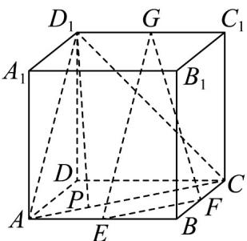

> [!faq]- 《专题17 空间直线、平面的平行-面面平行（高效培优期中专项训练）数学人教A版高一必修第二册》官方解析
>
> > [!success]- **【答案】** (1) $\frac{\sqrt{3}}{24}$ (2) $\frac{\sqrt{7}}{2}$
>
> > [!note]- **【解析】**
> > （1）依题意有 $S_{\triangle AEF}=\frac{1}{2}\cdot AE\cdot BF=\frac{1}{2}\cdot\frac{\sqrt{3}}{2}\cdot\frac{1}{2}=\frac{\sqrt{3}}{8}$ ，
> >
> > 所以三棱锥 $A-GEF$ 的体积 $V_{A-GEF}=V_{G-AEF}=\frac{1}{3}\cdot S_{\triangle AEF}\cdot DD_{1}=\frac{1}{3}\cdot\frac{\sqrt{3}}{8}\cdot1=\frac{\sqrt{3}}{24}$
> >
> > (2) 如图，
> >
> > 
> >
> > 连结 $D_{1}A, AC, D_{1}C$
> >
> > ∵E,F,G分别为AB,BC,C\_{1}D\_{1}的中点，
> >
> > $\therefore AC // EF, EF \not\subset$ 平面 $ACD_{1}$ , $AC \subset$ 平面 $ACD_{1}$
> >
> > $\therefore EF // 平面 ACD_{1},$
> >
> > $\because EG // AD_{1}, EG \not\subset$ 平面 $ACD_{1}$ , $AD_{1} \subset$ 平面 $ACD_{1}$
> >
> > $\therefore EG // \text{平面} ACD_{1}$
> >
> > $\because EF \cap EG = E$ ，∴平面 $EFG //$ 平面 $ACD_{1}$
> >
> > $\because D_{1}P//$ 平面 EFG，
> >
> > ∴点 P 在直线 AC 上，在 $\triangle ACD_{1}$ 中， $AD_{1}=\sqrt{2}, AC=2, CD_{1}=2$
> >
> > $S_{\triangle AD_1C} = \frac{1}{2}\times \sqrt{2}\times \sqrt{2^2 - (\frac{\sqrt{2}}{2})^2} = \frac{\sqrt{7}}{2}$
> >
> > ∴ 当时，线段的长度最小，最小值为 $\frac{S_{\triangle AD_{1}C}}{\frac{1}{2}\times AC}=\frac{\frac{\sqrt{7}}{2}}{\frac{1}{2}\times2}=\frac{\sqrt{7}}{2}$
