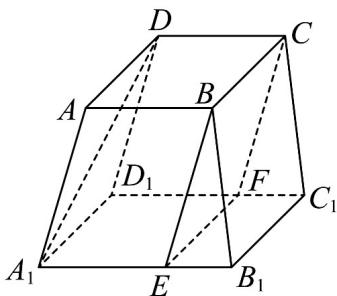

<!-- question-source:start -->
29. 如图，正四棱台 $ABCD - A_1B_1C_1D_1$ 中， $2A_1B_1 = 3AB$ ， $\frac{A_1E}{3} = \frac{2A_1B_1}{3}$ ， $\frac{D_1F}{3} = \frac{2D_1C_1}{3}$ .

(1)证明： $A_{1}D \parallel$ 平面BCFE；

(2)若 $DD_{1} = AD = 2$ ，求异面直线 $DD_{1}$ 与 $EB$ 所成的角的余弦值.
<!-- question-source:end -->

![[高中/课堂同步/题库/人教A版高中数学同步讲义(2026)/02_必修第二册/期中专项训练+期中模拟卷/专题17 空间直线、平面的平行-面面平行（高效培优期中专项训练）数学人教A版高一必修第二册/考点_05_面面平行证明线面平行/questions/answers/Q00077345A1.md]]
