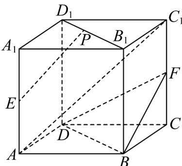

<!-- question-source:start -->
30．如图，在正方体 $ABCD-A_{1}B_{1}C_{1}D_{1}$ 中，E，F 分别为棱 $AA_{1}$ ， $CC_{1}$ 的中点，P 是线段 $B_{1}D_{1}$ 上的动点·证明：

(1) $AC_{1} / /$ 平面 $BDF$ ;

(2) $PE \parallel$ 平面 $BDF$ .
<!-- question-source:end -->

![[高中/课堂同步/题库/人教A版高中数学同步讲义(2026)/02_必修第二册/期中专项训练+期中模拟卷/专题17 空间直线、平面的平行-面面平行（高效培优期中专项训练）数学人教A版高一必修第二册/考点_05_面面平行证明线面平行/questions/answers/Q00077346A1.md]]
