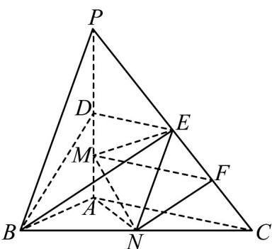

> [!faq]- 《专题17 空间直线、平面的平行-面面平行（高效培优期中专项训练）数学人教A版高一必修第二册》官方解析
>
> > [!success]- **【答案】** (1)证明见解析 (2) $\frac{\sqrt{105}}{10}$
>
> > [!note]- **【解析】**
> > （1）证明：取 $CE$ 的中点 $F$ ，连接 $MF$ 、 $NF$ ，如下图所示：
> >
> > 
> >
> > 因为 $D$ 为 $PA$ 的中点， $M$ 为 $AD$ 的中点，则 $DM = \frac{1}{2} AD = \frac{1}{2} PD$ ，即 $\frac{PD}{DM} = 2$
> >
> > 同理可得 $\frac{PE}{EF} = 2$ ，所以， $\frac{PD}{DM} = \frac{PE}{EF} = 2$ ，所以， $MF / / DE$
> >
> > 因为 $MF \notin$ 平面 BDE， $DE \subset$ 平面 BDE，所以， $MF \parallel$ 平面 BDE，
> >
> > 因为 N 、 F 分别为 BC 、 CE 的中点，所以，NF//BE ，
> >
> > 因为 $NF \notin$ 平面 BDE ， $BE \subset$ 平面 BDE ，所以， $NF \parallel$ 平面 BDE ，
> >
> > 因为 $MF \cap NF = F$ ， $MF$ 、 $NF \subset$ 平面 $MNF$ ，所以，平面 $MNF //$ 平面 $BDE$ ，
> >
> > 因为 $MN \subset$ 平面 MNF ，因此， $MN \parallel$ 平面 BDE .
> >
> > (2) 解：因为 $PA \perp$ 平面 $ABC$ ， $AB$ 、 $AN$ 、 $AC \subset$ 平面 $ABC$ ，则 $PA \perp AB$ ， $PA \perp AC$ ， $PA \perp AN$
> >
> > 因为 $PA = AC = 2$ ， $AB = 1$ ，则 $PB = \sqrt{PA^2 + AB^2} = \sqrt{2^2 + 1^2} = \sqrt{5}$
> >
> > 因为 E、N 分别为 PC、BC 的中点，则 $EN = \frac{1}{2} PB = \frac{\sqrt{5}}{2}$ ，
> >
> > 因为 $D$ 、 $E$ 分别为 $PA$ 、 $PC$ 的中点，则 $DE // AC$ 且 $DE = \frac{1}{2} AC = 1$
> >
> > 因为 $PA \perp AC$ ，则 $DE \perp PA$ ，
> >
> > 由（1）可知， $AM = DM = \frac{1}{4} PA = \frac{1}{2}$ ，所以， $ME = \sqrt{DE^2 + DM^2} = \sqrt{1^2 + \left(\frac{1}{2}\right)^2} = \frac{\sqrt{5}}{2}$
> >
> > 因为 $\angle BAC = 90^{\circ}$ ，则 $BC = \sqrt{AB^{2} + AC^{2}} = \sqrt{1^{2} + 2^{2}} = \sqrt{5}$
> >
> > 因为 N 为 BC 的中点，则 $AN = \frac{1}{2} BC = \frac{\sqrt{5}}{2}$ ，
> >
> > 所以， $MN = \sqrt{AM^2 + AN^2} = \sqrt{\left(\frac{1}{2}\right)^2 + \left(\frac{\sqrt{5}}{2}\right)^2} = \frac{\sqrt{6}}{2}$
> >
> > 所以， $\cos \angle MEN = \frac{ME^2 + NE^2 - MN^2}{2ME\cdot NE} = \frac{\frac{5}{4}\times 2 - \frac{3}{2}}{2\times\frac{5}{4}} = \frac{2}{5}$
> >
> > 故 $\sin \angle MEN = \sqrt{1 - \cos^2\angle MEN} = \sqrt{1 - \left(\frac{2}{5}\right)^2} = \frac{\sqrt{21}}{5}$
> >
> > 因此，点 $N$ 到直线 $ME$ 的距离为 $d = NE\sin \angle MEN = \frac{\sqrt{5}}{2}\times \frac{\sqrt{21}}{5} = \frac{\sqrt{105}}{10}$
